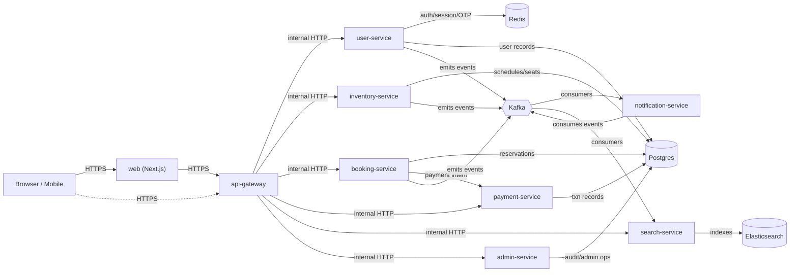

# Distributed Railway Booking Platform

> A single repository (monorepo) with multiple microservices for a distributed IRCTC-style railway
> booking platform. TypeScript end-to-end, pnpm workspaces, Turborepo.

## Architecture at a glance



The platform is a constellation of small, single-responsibility
microservices that talk over two channels:

- **Synchronous request/response** — HTTPS in, internal HTTP between
  services. `api-gateway` is the only thing the public internet sees.
- **Asynchronous events** — Kafka topics, with versioned Zod schemas
  in `packages/contracts`. Every service is both a producer (of
  domain events) and a consumer (of events it cares about).

Each service owns its own Postgres schema (where applicable), its own
Redis namespace, and its own Kafka consumer group. There is no shared
database and no service-to-service HTTP coupling on the write path —
state changes flow through Kafka and get fanned out.

## Tech stack

| Layer               | Choice                                                                          |
| ------------------- | ------------------------------------------------------------------------------- |
| Language            | TypeScript (Node 22, ESM)                                                       |
| Package manager     | pnpm workspaces + Turborepo                                                     |
| API transport       | HTTPS / HTTP/JSON (Express in services, Next.js Route Handlers in `web`)        |
| Inter-service       | Internal HTTP through `api-gateway`                                             |
| Eventing            | Apache Kafka (KRaft mode)                                                       |
| Event contracts     | Zod schemas in `@irctc/contracts`                                               |
| Auth                | JWT (HS256) cookies, bcrypt-hashed passwords + OTPs in Redis                    |
| Datastores          | Postgres (records), Redis (sessions, OTPs, idempotency), Elasticsearch (search) |
| Observability       | OpenTelemetry → OTLP, Pino → Loki                                               |
| Transactional email | SendGrid (pluggable `EmailProvider` strategy in `notification-service`)         |
| Local dev stack     | Docker Compose                                                                  |

## Repository layout

```text
.
├── apps/
│   ├── web/                    # (planned) Next.js frontend
│   ├── api-gateway/            # (planned) HTTPS termination, JWT validation, routing
│   ├── user-service/           # ✅ auth, registration, sessions, OTP
│   ├── notification-service/   # ✅ Kafka consumer, transactional email
│   ├── inventory-service/      # (planned) trains, schedules, seat availability
│   ├── booking-service/        # (planned) reservations, PNR, holds
│   ├── payment-service/        # (planned) payment intents, reconciliation
│   ├── search-service/         # (planned) Elasticsearch query layer
│   └── admin-service/          # (planned) back-office / audit
├── packages/
│   ├── contracts/              # Zod event schemas + topic / consumer-group constants
│   ├── kafka/                  # producer/consumer factories, runner, retry policies
│   ├── redis/                  # singleton client, IdempotencyRepository
│   ├── http/                   # response envelope, request context
│   ├── logger/                 # Pino child logger
│   ├── telemetry/              # OpenTelemetry SDK + Kafka header propagation
│   ├── middleware/             # shared Express middleware (helmet, CORS, request-id)
│   ├── errors/                 # canonical error codes
│   ├── eslint-config/          # workspace ESLint config
│   └── typescript-config/      # workspace tsconfig bases
├── infra/
│   └── kafka-init/             # topic-creation sidecar for local dev
├── scripts/                    # repo-level scripts
├── docker-compose.yml          # local dev stack
├── turbo.json
├── pnpm-workspace.yaml
└── package.json
```

✅ = implemented today. (planned) = on the roadmap below.

## Services

### Implemented

- **`user-service`** — registration, login, JWT issuance, multi-device
  session management, password recovery. Owns the `User` table, the
  Redis session/OTP keyspace, and produces `user.otp-requested.v1`
  and `user.logged-in.v1`.
- **`notification-service`** — headless Kafka consumer that turns
  events into emails (OTP, welcome back). Pluggable `EmailProvider`
  with a SendGrid implementation.

### Planned

- **`api-gateway`** — single ingress. TLS termination, JWT validation,
  rate limiting, request-id propagation, request routing, CORS.
- **`inventory-service`** — trains, schedules, stations, seat
  availability. Source of truth for what _can_ be booked. Emits
  inventory events that feed `search-service` and `booking-service`.
- **`booking-service`** — reservation lifecycle: hold → confirm →
  cancel, PNR generation, fare calculation. Orchestrates
  `inventory-service` (seat allocation) and `payment-service`
  (payment intent). Emits booking events for `notification-service`
  and `search-service`.
- **`payment-service`** — payment-intent creation, webhook
  ingestion, reconciliation. Owns no business state beyond the
  payment record itself; everything else is `booking-service`'s
  concern.
- **`search-service`** — read-only query layer over Elasticsearch.
  Consumes inventory + booking events and projects them into ES
  indices; serves search and filter queries to `api-gateway`.
- **`admin-service`** — internal-only back-office. Operator
  workflows, audit, fraud review. Never exposed publicly.
- **`web`** — Next.js frontend (App Router). Talks only to
  `api-gateway`; never directly to internal services. Server
  components for SEO, client components for the booking flow.

## Shared packages

| Package                   | Purpose                                                                                                                        |
| ------------------------- | ------------------------------------------------------------------------------------------------------------------------------ |
| `@irctc/contracts`        | Zod schemas for every Kafka event, plus `KAFKA_TOPICS` / `CONSUMER_GROUPS` constants. Versioned per event (`.v1`, `.v2`, …).   |
| `@irctc/kafka`            | `createKafkaClient`, `createConsumer`, `KafkaProducerManager`, `KafkaConsumerRunner`, retry policies, OTel header propagation. |
| `@irctc/redis`            | Singleton client factory + `IdempotencyRepository` (the `PROCESSING` / `PROCESSED` state machine).                             |
| `@irctc/http`             | `successResponse` / `errorResponse` envelope, request context.                                                                 |
| `@irctc/logger`           | Pino-based child logger; every consumer/service creates a named child.                                                         |
| `@irctc/telemetry`        | OpenTelemetry SDK init, Kafka header → trace-context extraction.                                                               |
| `@irctc/middleware`       | Shared Express middleware.                                                                                                     |
| `@irctc/errors`           | Canonical error codes shared across services.                                                                                  |
| `@repo/eslint-config`     | Workspace ESLint config.                                                                                                       |
| `@repo/typescript-config` | `tsconfig` bases for the monorepo.                                                                                             |

## Kafka contracts

The full source of truth for event shapes lives in
`packages/contracts/src/`. Producers and consumers both depend on the
same Zod schemas, so a contract change is a typed compile error
rather than a runtime surprise.

Versioning policy: a breaking payload change is a new schema
(`OTPRequestedV2`) **on a new topic** (`user.otp-requested.v2`).
Consumers must `safeParse` and route parse failures to a poison log;
they never silently drop.

## Getting started

There are two ways to get the platform up and running locally:

### Option 1: Docker Compose Setup (Easiest & Recommended)

This option spins up all infrastructure (Postgres, Redis, Kafka, Elasticsearch, Tempo, Grafana) and compiles/runs all microservices inside Docker containers. **No local Node.js, pnpm, or manual database migration setup is needed.**

#### Prerequisites

- Docker & Docker Compose installed.
- A SendGrid API Key (for email notifications).

#### Steps

1. **Clone the repository:**

   ```bash
   git clone https://github.com/Pritam-25/distributed_railway_booking_platform.git
   cd distributed_railway_booking_platform
   ```

2. **Configure environment variables:**
   Copy the root-level `.env.example` to `.env`:

   ```bash
   cp .env.example .env
   ```

   Open the root `.env` file and fill in your SendGrid API key and verified sender email address:

   ```env
   SENDGRID_API_KEY=SG.your_actual_api_key
   SENDGRID_SENDER=your-sender@email.com
   ```

3. **Start the platform:**
   ```bash
   docker compose up -d --build
   ```
   This will build the service images, initialize the database migrations, and boot the entire platform.

---

### Option 2: Manual Local Development Setup (For development on host)

Choose this option if you want to run the microservices directly on your host machine (e.g. for debugging with hot-reloading).

#### Prerequisites

- Node.js ≥ 22
- pnpm ≥ 9
- Docker (to run database/infrastructure backends)

#### Steps

1. **Clone the repository:**

   ```bash
   git clone https://github.com/Pritam-25/distributed_railway_booking_platform.git
   cd distributed_railway_booking_platform
   ```

2. **Spin up only the infrastructure backends:**

   ```bash
   # Starts Postgres, Redis, Kafka, Elasticsearch, Tempo, Grafana, and topic-init sidecar
   docker compose up -d postgres redis kafka kafka-ui kafka-init elasticsearch tempo grafana
   ```

3. **Install workspace dependencies:**

   ```bash
   pnpm install
   ```

4. **Generate Prisma Client & run migrations:**

   ```bash
   pnpm --filter user-service prisma generate
   pnpm --filter user-service prisma migrate dev
   ```

5. **Configure environment files for each service:**
   Copy the local `.env.example` templates to `.env` in the respective apps:

   ```bash
   cp apps/user-service/.env.example apps/user-service/.env
   cp apps/notification-service/.env.example apps/notification-service/.env
   ```

   _Note: Open `apps/notification-service/.env` and update the SendGrid credentials if you wish to send real emails during local host development._

6. **Start microservices in development mode:**
   ```bash
   pnpm --filter user-service dev
   pnpm --filter notification-service dev
   ```

---

### What `docker compose up` gives you

| Service                | Host port             | Container                    | Purpose                                                          |
| ---------------------- | --------------------- | ---------------------------- | ---------------------------------------------------------------- |
| `postgres`             | `5432`                | `irctc-postgres`             | App DB. `admin` / `password` / `irctc_db`.                       |
| `redis`                | `6379`                | `irctc-redis`                | Sessions, OTPs, rate limits, idempotency.                        |
| `kafka`                | `9092`, `29092`       | `irctc-kafka`                | KRaft broker. `9092` for the host, `29092` for other containers. |
| `kafka-ui`             | `8080`                | `irctc-kafka-ui`             | Browse topics, consumer groups, messages.                        |
| `kafka-init`           | —                     | `irctc-kafka-init`           | One-shot sidecar that pre-creates the `user.*` topics.           |
| `elasticsearch`        | `9200`                | `irctc-elasticsearch`        | Search index store.                                              |
| `tempo`                | `3200`, `4317`/`4318` | `irctc-tempo`                | OTel tracing collector & query backend.                          |
| `grafana`              | `3000`                | `irctc-grafana`              | Metrics & Traces visualization UI (admin/admin).                 |
| `user-service`         | `4001`                | `irctc-user-service`         | The auth API.                                                    |
| `notification-service` | —                     | `irctc-notification-service` | Headless email worker. No HTTP listener.                         |

> **Heads-up on `KAFKA_BROKERS`.** The dev script runs on the **host**
> and reaches Kafka at `localhost:9092`. Containers reach it at
> `irctc-kafka:29092`. Both are wired in `docker-compose.yml`.

### Observability & Tracing

The platform is integrated with **OpenTelemetry** for distributed tracing. Traces flow automatically from the services (e.g., `user-service` and `notification-service`) into **Tempo** and can be visualized in **Grafana**.

- **Grafana Dashboard**: [http://localhost:3000](http://localhost:3000) (default credentials: `admin` / `admin`).
- **Tempo Backend**: Queryable inside Grafana via the pre-configured `Tempo` datasource.

#### End-to-End Tracing with Kafka Propagation

We propagate tracing context across asynchronous Kafka message boundaries (via custom headers using standard W3C propagation). This allows you to follow a single request's lifecycle completely:

1. A client initiates an action (e.g., requesting an OTP from `user-service`).
2. `user-service` generates a **Trace ID** and publishes the `user.otp-requested.v1` event containing tracing metadata in the Kafka message headers.
3. `notification-service` consumes the event, extracts the parent trace context, and processes it under the same **Trace ID**.

To view the full trace:

1. Locate the `traceId` in your application logs or responses.
2. Open Grafana, go to **Explore**, and select **Tempo** as the datasource.
3. Query by the `Trace ID` to view the unified call graph spanning both HTTP requests and Kafka event boundaries.

Tear down:

```bash
docker compose down      # stop, keep volumes
docker compose down -v   # stop, wipe all data (full reset)
```

## Daily commands

```bash
# Run a single service in watch mode
pnpm --filter user-service dev

# Build everything (packages first, then apps)
pnpm build

# Typecheck, lint, format
pnpm typecheck
pnpm lint
pnpm format
```

## Project conventions

- **Conventional commits** (`feat:`, `fix:`, `refactor:`, …) enforced
  by `commitlint` + husky `commit-msg` hook.
- **Pre-commit** runs ESLint and Prettier via `lint-staged`.
- **Workspace deps** are referenced as `"@irctc/contracts":
"workspace:*"`. No version pinning for first-party packages.
- **TypeScript strict mode** is on for every workspace; shared
  `tsconfig` bases in `@repo/typescript-config`.
- **No service-to-service HTTP on the write path.** Writes go
  through `api-gateway`; cross-service state changes propagate
  through Kafka events.
- **No shared database.** Each service owns its own Postgres
  schemas/tables and its own Redis keyspace.

## Roadmap

The service roadmap, in roughly the order it makes sense to build
them:

1. ✅ `user-service` — auth foundation
2. ✅ `notification-service` — fan-out to email
3. ⏭️ `api-gateway` — single ingress, JWT validation, rate limiting
4. ⏭️ `admin-service` — back-office / audit
5. ⏭️ `inventory-service` — schedules, seat availability
6. ⏭️ `search-service` — Elasticsearch query layer
7. ⏭️ `booking-service` — reservation lifecycle
8. ⏭️ `payment-service` — payment intents, webhooks
9. ⏭️ `web` — Next.js customer-facing frontend

## See also

- [`apps/user-service/README.md`](apps/user-service/README.md) —
  full endpoint table, Redis data model, Kafka contract,
  failure modes.
- [`apps/notification-service/README.md`](apps/notification-service/README.md) —
  consumer architecture, idempotency, event age expiration, email
  provider abstraction.
- [`packages/contracts`](packages/contracts) — every event schema and
  topic constant.
- [`docker-compose.yml`](docker-compose.yml) — the local stack this
  README references.

---

⭐ **Star the Repository**

If you find this project informative or useful, please consider giving it a star on [GitHub](https://github.com/Pritam-25/distributed_railway_booking_platform)!
