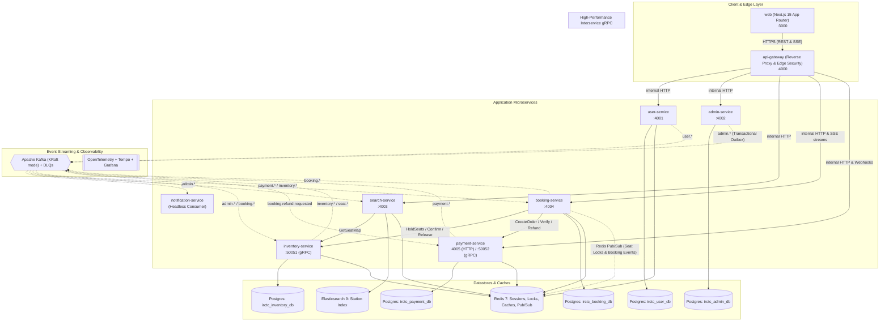
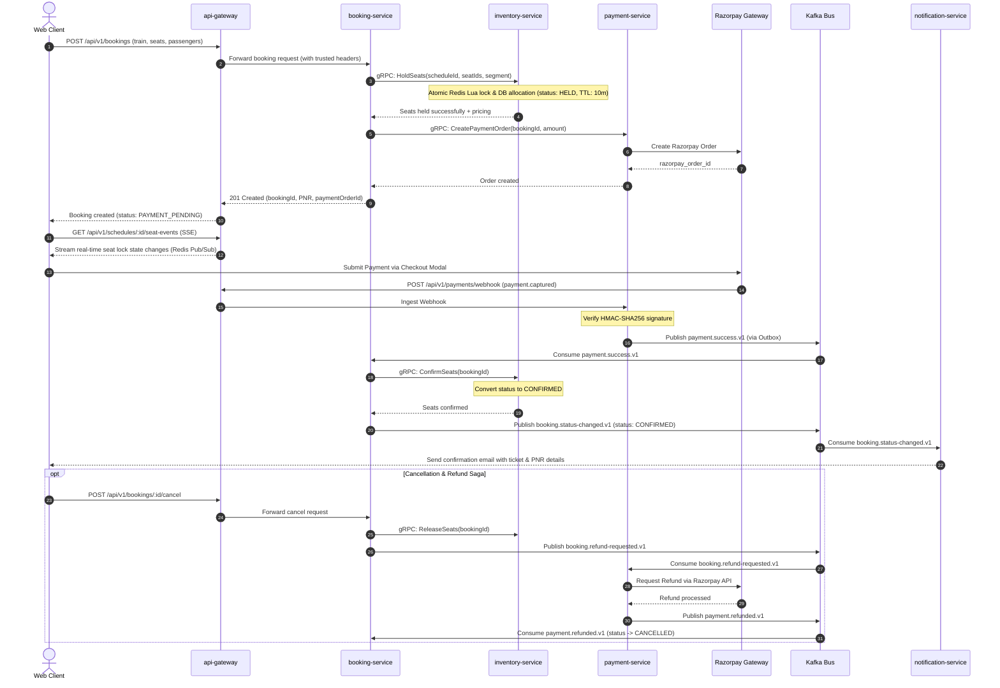

# Distributed Railway Booking Platform

> A production-grade, distributed microservices platform modeled after high-concurrency railway reservation systems (IRCTC). Built with TypeScript end-to-end, Turborepo, pnpm workspaces, event-driven architecture with Apache Kafka, high-performance inter-service gRPC, and a modern Next.js 15 frontend.

---

## Architecture at a Glance


```mermaid
flowchart TD
  subgraph ClientLayer ["Client & Edge Layer"]
    WEB["web (Next.js 15 App Router)\n:3000"]
    GW["api-gateway (Reverse Proxy & Edge Security)\n:4000"]
  end

  subgraph AppServices ["Application Microservices"]
    US["user-service\n:4001"]
    AD["admin-service\n:4002"]
    SR["search-service\n:4003"]
    BK["booking-service\n:4004"]
    PAY["payment-service\n:4005 (HTTP) / :50052 (gRPC)"]
    INV["inventory-service\n:50051 (gRPC)"]
    NS["notification-service\n(Headless Consumer)"]
  end

  subgraph InterserviceRPC ["High-Performance Interservice gRPC"]
    BK -- "HoldSeats / Confirm / Release" --> INV
    BK -- "CreateOrder / Verify / Refund" --> PAY
    SR -- "GetSeatMap" --> INV
  end

  subgraph Datastores ["Datastores & Caches"]
    PG_U[("Postgres: irctc_user_db")]
    PG_A[("Postgres: irctc_admin_db")]
    PG_I[("Postgres: irctc_inventory_db")]
    PG_B[("Postgres: irctc_booking_db")]
    PG_P[("Postgres: irctc_payment_db")]
    R[("Redis 7: Sessions, Locks, Caches, Pub/Sub")]
    ES[("Elasticsearch 9: Station Index")]
  end

  subgraph Messaging ["Event Streaming & Observability"]
    K{{"Apache Kafka (KRaft mode) + DLQs"}}
    OTEL[["OpenTelemetry + Tempo + Grafana"]]
  end

  %% Client & Gateway Flow
  WEB -- "HTTPS (REST & SSE)" --> GW
  GW -- "internal HTTP" --> US
  GW -- "internal HTTP" --> AD
  GW -- "internal HTTP" --> SR
  GW -- "internal HTTP & SSE streams" --> BK
  GW -- "internal HTTP & Webhooks" --> PAY

  %% Service to Datastores
  US --> PG_U
  US --> R
  AD --> PG_A
  INV --> PG_I
  INV --> R
  BK --> PG_B
  BK --> R
  PAY --> PG_P
  PAY --> R
  SR --> ES
  SR --> R

  %% Event Streaming
  US -. "user.*" .-> K
  AD -. "admin.* (Transactional Outbox)" .-> K
  INV -. "inventory.* / seat.*" .-> K
  BK -. "booking.*" .-> K
  PAY -. "payment.*" .-> K

  K -. "events" .-> NS
  K -. "admin.*" .-> SR
  K -. "admin.* / booking.*" .-> INV
  K -. "payment.* / inventory.*" .-> BK
  K -. "booking.refund-requested" .-> PAY

  %% Real-time SSE
  BK -. "Redis Pub/Sub (Seat Locks & Booking Events)" .-> R
```

The platform is designed around **Domain-Driven Design (DDD)** and **Clean Architecture**:

- **Edge Security & Gateway Ingress:** `api-gateway` is the single point of entry for clients. It enforces Helmet headers, CORS policies, JWT validation, client identity header scrubbing/injection (`x-user-id`, `x-user-email`, `x-session-id`), token-bucket rate limiting via Redis, and circuit breaking via `@irctc/resilience`.
- **Dual Communication Protocol:**
  - **Internal HTTP & Realtime SSE:** Standardized `@irctc/http` response envelopes (`successResponse`/`errorResponse`) for public APIs, with Server-Sent Events (SSE) streaming live seat locks and booking status updates.
  - **Inter-Service gRPC:** High-performance, low-latency binary RPC via `@irctc/grpc` (`nice-grpc`) for synchronous coordination (e.g. `booking-service` holds seats on `inventory-service` and creates payment orders on `payment-service`).
- **Asynchronous Event-Driven Architecture:** Apache Kafka in KRaft mode. Services utilize the **Transactional Outbox Pattern** to reliably publish domain events with versioned Zod schemas and protobuf contracts from `@irctc/contracts`. Every topic has an automated Dead-Letter Queue (DLQ).
- **Database-per-Service:** Each microservice owns its independent PostgreSQL database instance (`irctc_user_db`, `irctc_admin_db`, `irctc_inventory_db`, `irctc_booking_db`, `irctc_payment_db`). There are no cross-database foreign keys or queries.
- **Concurrency & Distributed Locking:** Redis-backed distributed locks and Lua scripts guarantee that seat segments along train routes cannot be double-booked during concurrent checkout sessions.

---

## Tech Stack

| Layer                   | Technology                           | Details                                                                 |
| :---------------------- | :----------------------------------- | :---------------------------------------------------------------------- |
| **Language & Runtime**  | TypeScript / Node.js 22 (ESM)        | Strict mode, `nodenext`, verbatim module syntax                         |
| **Monorepo Tooling**    | pnpm 11 workspaces + Turborepo 2     | Caching, parallel builds, pipeline task orchestration                   |
| **Frontend Web App**    | Next.js 15 (App Router)              | React 19, Tailwind CSS, shadcn/ui, TanStack Query, Lucide icons         |
| **API Gateway & HTTP**  | Express 5 / `http-proxy-middleware`  | Ingress routing, cookie auth, header injection, circuit breaking        |
| **Inter-Service RPC**   | gRPC (`nice-grpc` + `@bufbuild/buf`) | Bearer token authentication, deadline propagation, health probes        |
| **Real-time Streaming** | Server-Sent Events (SSE)             | Live seat map availability locks & booking progress via Redis Pub/Sub   |
| **Event Broker**        | Apache Kafka (KRaft mode 7.8)        | Event sourcing, DLQ routing, consumer groups, replay protection         |
| **Event Contracts**     | Zod + Protobuf (`@irctc/contracts`)  | Versioned schemas (`.v1`), wire validations, generated types            |
| **Datastores**          | PostgreSQL 16 (Prisma ORM)           | 5 isolated databases, migrations, transactional outbox tables           |
| **Caching & Locks**     | Redis 7 (`ioredis`)                  | Sessions, OTPs, rate-limit buckets, Redlock, Lua scripts for seat locks |
| **Search Engine**       | Elasticsearch 9                      | Station autocomplete with edge n-gram & fuzzy matching analyzers        |
| **Payment Gateway**     | Razorpay                             | Order creation, HMAC signature verification, webhooks, refunds          |
| **Transactional Email** | SendGrid                             | Pluggable `EmailProvider` strategy in `notification-service`            |
| **Distributed Tracing** | OpenTelemetry + Grafana Tempo        | W3C trace context propagation across HTTP & Kafka headers               |
| **Metrics & Logs**      | Pino + Grafana Dashboard             | Structured JSON logs with correlation IDs (`traceId`, `requestId`)      |
| **Local Orchestration** | Docker Compose                       | Multi-profile setups (`prod`, `dev`, `debug`)                           |

---

## Repository Layout

```text
.
├── apps/
│   ├── web/                    # Next.js 15 customer frontend (search, booking, seat map, payments)
│   ├── api-gateway/            # Edge ingress, reverse proxy, JWT auth, rate limiting, SSE streaming
│   ├── user-service/           # Auth, registration, multi-device sessions, OTP verification, JWT
│   ├── admin-service/          # Trains, coaches, seat templates, routes, schedule management
│   ├── inventory-service/      # Dynamic seat inventory, station segment locking, gRPC server (:50051)
│   ├── search-service/         # Station autocomplete, train search, Elasticsearch projections (:4003)
│   ├── booking-service/        # Saga orchestrator, PNR generation, hold lifecycle, SSE streams (:4004)
│   ├── payment-service/        # Razorpay integration, webhook processing, refund saga (:4005 / :50052)
│   └── notification-service/   # Headless Kafka worker, SendGrid transactional emails, 2-phase idempotency
├── packages/
│   ├── contracts/              # Versioned Zod event schemas, protobuf definitions, Kafka topics & groups
│   ├── grpc/                   # Client & server factories, token auth, deadline propagation, health probes
│   ├── kafka/                  # Producer/consumer runners, retry policies, DLQ routing, OTel context
│   ├── redis/                  # Singleton Redis client, Redlock, IdempotencyRepository lease manager
│   ├── http/                   # Standardized response envelope, HTTP error mapping, health check routers
│   ├── logger/                 # Structured Pino logger with contextual child logger bindings
│   ├── telemetry/              # OpenTelemetry SDK initialization, W3C trace propagation (HTTP & Kafka)
│   ├── middleware/             # Express middlewares: auth verification, input validation, header scrubbing
│   ├── resilience/             # Token-bucket rate limiters and circuit breaker state machines
│   ├── openapi/                # Shared OpenAPI 3.1 specification generation and schema builders
│   ├── errors/                 # Canonical system-wide error codes and ApiError hierarchy
│   ├── eslint-config/          # Shared ESLint configuration rules
│   └── typescript-config/      # Shared tsconfig compiler base configurations
├── infra/
│   ├── postgres/               # Multi-database init scripts (irctc_user_db, admin, inventory, booking, payment)
│   ├── kafka-init/             # Topic initialization sidecar container with automated partition configs
│   ├── elasticsearch-init/     # Elasticsearch user bootstrapping sidecar
│   ├── tempo/                  # Tempo distributed tracing configuration
│   └── grafana/                # Pre-configured Grafana dashboards and Tempo datasource provisioning
├── scripts/                    # Topic initialization scripts, Postman sync tools, database utilities
├── docker-compose.yml          # Unified multi-profile container stack
├── turbo.json                  # Turborepo task dependencies and caching pipeline
├── pnpm-workspace.yaml         # Workspace configuration and native build flags
└── package.json                # Repo root scripts and dev toolchain
```

---

## Completed Microservices

All 9 core services are fully implemented, tested, and integrated:

### 1. `web` (Customer-Facing Web Application)

- **Port:** `3000` | **Tech:** Next.js 15 App Router, React 19, Tailwind CSS, shadcn/ui, TanStack Query.
- **Capabilities:**
  - **Fast Station Search:** Real-time autocomplete search bar powered by `search-service`.
  - **Train Schedule & Availability:** Train search by origin, destination, and travel date with quota filtering (`GENERAL`, `TATKAL`, `LADIES`, `SENIOR_CITIZEN`).
  - **Interactive Visual Seat Map:** Graphical coach layouts with real-time seat lock state updates via Server-Sent Events (SSE).
  - **Passenger Details & Quota Form:** Berth preferences (Lower, Middle, Upper, Side Lower, Side Upper) and ID proof collection.
  - **Razorpay Checkout Integration:** Seamless client-side checkout popup with real-time verification and auto-confirmation.
  - **Booking Management:** Live PNR tracking, booking status history, downloadable ticket views, and cancellation/refund actions.

### 2. `api-gateway` (Edge Ingress & Reverse Proxy)

- **Port:** `4000` | **Tech:** Express 5, `http-proxy-middleware`, `@irctc/resilience`.
- **Capabilities:**
  - **Central Ingress:** Single public entry point for all frontend and mobile client traffic.
  - **Security & Headers:** Helmet HTTP headers, CORS validation, cookie parsing, and client header scrubbing (`x-user-id`, `x-user-email`, `x-session-id`, `x-admin-id`) to prevent spoofing.
  - **Authentication Levels:** `none` (public), `required` (verified user JWT), `optional` (guest or user), `admin` (verified admin JWT). Injects trusted user context headers downstream.
  - **Rate Limiting:** Redis-backed token bucket rate limiters with presets (`auth` for credential endpoints, `default` for standard endpoints).
  - **Service Resilience:** Individual circuit breakers per upstream service.
  - **SSE Pass-Through:** Configured for long-lived Server-Sent Events streams (`/api/v1/bookings` and `/api/v1/schedules`) without circuit breaker timeouts.

### 3. `user-service` (Identity & Authentication)

- **Port:** `4001` | **Database:** `irctc_user_db` (PostgreSQL via Prisma).
- **Capabilities:**
  - **Authentication:** Registration, login, bcrypt password hashing, and JWT issuance (access + refresh token rotation).
  - **Multi-Device Sessions:** Active session tracking in Redis with remote logout and session revocation (`logout-all`).
  - **OTP Verification:** Time-sensitive Redis-backed OTPs for email verification and password reset.
  - **Event Publishing:** Emits `user.otp-requested.v1` and `user.logged-in.v1` to Kafka.

### 4. `admin-service` (Railway Back-Office & Master Data)

- **Port:** `4002` | **Database:** `irctc_admin_db` (PostgreSQL via Prisma).
- **Capabilities:**
  - **Master Data Management:** Stations, trains, coaches, seat layout templates, routes, and route stations with ordered sequence numbers and cumulative distances.
  - **Schedule Generation:** Creating and publishing train schedules with dynamic departure/arrival dates.
  - **Transactional Outbox:** All master data and schedule mutations atomically commit outbox events (`admin.train-created.v1`, `admin.station-created.v1`, `admin.schedule-created.v1`, etc.) polled and dispatched to Kafka.

### 5. `inventory-service` (Seat Inventory & Allocation Engine)

- **Port:** `50051` (gRPC) | **Database:** `irctc_inventory_db` (PostgreSQL via Prisma).
- **Capabilities:**
  - **High-Performance gRPC API:** Exposes `InventoryService` with methods:
    - `HoldSeats`: Temporarily locks seat segments for a booking with an expiry TTL.
    - `ConfirmSeats`: Converts held seats into permanently confirmed allocations upon successful payment.
    - `ReleaseSeats`: Frees held seats if payment expires, fails, or is cancelled.
    - `GetSeatMap`: Retrieves coach-by-coach seat occupancy status across specific station segments.
  - **Segment-Level Allocation:** Supports partial-route bookings by tracking sequence intervals (`fromSequence` to `toSequence`). Multiple passengers can occupy the same physical seat on non-overlapping journey segments.
  - **Concurrency Safety:** Distributed locks and atomic Redis Lua scripts prevent race conditions and double-booking during seat holds.
  - **Event Projection:** Consumes `admin.schedule-created.v1` to dynamically project seat inventory and publishes `inventory.seats-held.v1`, `seat.availability-changed.v1`, etc.

### 6. `search-service` (Discovery & Autocomplete Query Layer)

- **Port:** `4003` | **Datastores:** Elasticsearch 9 + Redis 7.
- **Capabilities:**
  - **Station Suggest:** Prefix, edge n-gram, and fuzzy autocomplete (`GET /api/v1/search/stations/suggest`) with relevance scoring.
  - **Train Search:** Discovery endpoint (`GET /api/v1/search/trains`) matching trains running between origin and destination stations on specified journey dates.
  - **Seat Map Discovery:** Queries `inventory-service` via gRPC to retrieve real-time coach seat layouts and availability (`GET /api/v1/search/schedules/:scheduleId/seat-map`).
  - **Read Caching:** Cache-aside Redis layer with short TTLs prevents repeated Elasticsearch queries for popular station searches.
  - **Elasticsearch Projection:** Consumes station events (`admin.station-created.v1`, `admin.station-updated.v1`, `admin.station-deactivated.v1`) to maintain up-to-date search indices.

### 7. `booking-service` (Reservation Lifecycle & Saga Orchestrator)

- **Port:** `4004` | **Database:** `irctc_booking_db` (PostgreSQL via Prisma).
- **Capabilities:**
  - **Distributed Saga Orchestrator:** Coordinates multi-step booking transactions across `inventory-service` (via gRPC) and `payment-service` (via gRPC).
  - **State Machine:** Governs transitions across `PENDING` → `SEATS_HELD` → `PAYMENT_PENDING` → `CONFIRMING` → `CONFIRMED`, `CANCELLING` → `CANCELLED`, `EXPIRED`, and `FAILED`.
  - **PNR Generation:** Generates unique 10-digit Passenger Name Record (PNR) identifiers.
  - **Real-Time SSE Streaming:** Server-Sent Events endpoints for:
    - Live booking state updates (`/api/v1/bookings/:bookingId/events`).
    - Live seat locking updates across schedules (`/api/v1/schedules/:scheduleId/seat-events`).
  - **Cancellation & Compensation:** Handles user cancellations, invokes seat release on inventory, and initiates automated refund requests.

### 8. `payment-service` (Payment Processing & Webhook Handler)

- **Ports:** `4005` (REST) & `50052` (gRPC) | **Database:** `irctc_payment_db` (PostgreSQL via Prisma).
- **Capabilities:**
  - **Dual API Surface:**
    - **gRPC Server (`:50052`):** Low-latency RPCs for `CreatePaymentOrder`, `VerifyPayment`, `GetPaymentStatus`, and `ProcessRefund`.
    - **REST API (`:4005`):** Public webhook ingestion (`/api/v1/payments/webhook`) and client verification endpoints.
  - **Razorpay Integration:** Creates Razorpay payment orders, verifies HMAC-SHA256 signatures, captures transactions, and manages refunds.
  - **Automated Refund Saga:** Consumes `booking.refund-requested.v1`, triggers Razorpay API refund operations, updates refund ledger records, and emits `payment.refunded.v1`.

### 9. `notification-service` (Event-Driven Notification Worker)

- **Type:** Headless Kafka Consumer Worker.
- **Capabilities:**
  - **Asynchronous Email Worker:** Consumes Kafka events (`user.otp-requested.v1`, `user.logged-in.v1`, booking confirmation events) and dispatches transactional emails.
  - **SendGrid Integration:** Clean `EmailProvider` interface with a concrete SendGrid API implementation and email template rendering.
  - **Idempotency & Replay Protection:** 2-phase Redis idempotency lease (`reserveIfNew` → `markProcessed`, with release on failure) prevents duplicate email deliveries across consumer restarts.

---

## Distributed Booking Saga & Real-time Flow

The diagram below illustrates the end-to-end booking transaction and compensation lifecycle:


```mermaid
sequenceDiagram
  autonumber
  actor User as Web Client
  participant GW as api-gateway
  participant BS as booking-service
  participant IS as inventory-service
  participant PS as payment-service
  participant RZ as Razorpay Gateway
  participant KF as Kafka Bus
  participant NS as notification-service

  %% 1. Seat Hold
  User->>GW: POST /api/v1/bookings (train, seats, passengers)
  GW->>BS: Forward booking request (with trusted headers)
  BS->>IS: gRPC: HoldSeats(scheduleId, seatIds, segment)
  Note over IS: Atomic Redis Lua lock & DB allocation (status: HELD, TTL: 10m)
  IS-->>BS: Seats held successfully + pricing
  BS->>PS: gRPC: CreatePaymentOrder(bookingId, amount)
  PS->>RZ: Create Razorpay Order
  RZ-->>PS: razorpay_order_id
  PS-->>BS: Order created
  BS-->>GW: 201 Created (bookingId, PNR, paymentOrderId)
  GW-->>User: Booking created (status: PAYMENT_PENDING)

  %% 2. Real-Time SSE Updates
  User->>GW: GET /api/v1/schedules/:id/seat-events (SSE)
  GW-->>User: Stream real-time seat lock state changes (Redis Pub/Sub)

  %% 3. Payment & Confirmation
  User->>RZ: Submit Payment via Checkout Modal
  RZ->>GW: POST /api/v1/payments/webhook (payment.captured)
  GW->>PS: Ingest Webhook
  Note over PS: Verify HMAC-SHA256 signature
  PS->>KF: Publish payment.success.v1 (via Outbox)
  KF->>BS: Consume payment.success.v1
  BS->>IS: gRPC: ConfirmSeats(bookingId)
  Note over IS: Convert status to CONFIRMED
  IS-->>BS: Seats confirmed
  BS->>KF: Publish booking.status-changed.v1 (status: CONFIRMED)
  KF->>NS: Consume booking.status-changed.v1
  NS-->>User: Send confirmation email with ticket & PNR details

  %% 4. Cancellation & Compensation (Alternative flow)
  opt Cancellation & Refund Saga
    User->>GW: POST /api/v1/bookings/:id/cancel
    GW->>BS: Forward cancel request
    BS->>IS: gRPC: ReleaseSeats(bookingId)
    BS->>KF: Publish booking.refund-requested.v1
    KF->>PS: Consume booking.refund-requested.v1
    PS->>RZ: Request Refund via Razorpay API
    RZ-->>PS: Refund processed
    PS->>KF: Publish payment.refunded.v1
    KF->>BS: Consume payment.refunded.v1 (status -> CANCELLED)
  end
```

---

## Shared Packages (`@irctc/*`)

The monorepo features a clean separation of shared concerns in `packages/`:

| Package                       | Purpose                                                                                                                                                                   |
| :---------------------------- | :------------------------------------------------------------------------------------------------------------------------------------------------------------------------ |
| **`@irctc/contracts`**        | Source of truth for event schemas (Zod `.v1`), Protobuf definitions & generated gRPC stubs, `KAFKA_TOPICS`, `CONSUMER_GROUPS`, and money conversion/arithmetic utilities. |
| **`@irctc/grpc`**             | `nice-grpc` client/server factories, bearer token authentication, deadline propagation, RPC logging, and standard `grpc.health.v1` health check handlers.                 |
| **`@irctc/kafka`**            | KafkaJS wrapper, producer managers, consumer runners, retry policies, automated Dead-Letter Queue (DLQ) routing, and OpenTelemetry trace propagation.                     |
| **`@irctc/redis`**            | Singleton Redis client factory, distributed locks (Redlock), and `IdempotencyRepository` (2-phase `reserveIfNew` / `markProcessed` state machine).                        |
| **`@irctc/resilience`**       | Token-bucket rate limiting algorithms and stateful Circuit Breaker implementations (`CLOSED`, `OPEN`, `HALF_OPEN`).                                                       |
| **`@irctc/http`**             | Standardized JSON envelope (`successResponse`, `errorResponse`), HTTP status codes, request context, and unified `/health/live` & `/health/ready` routers.                |
| **`@irctc/logger`**           | Pino-based structured logging with contextual metadata (trace ID, correlation ID, service name).                                                                          |
| **`@irctc/telemetry`**        | OpenTelemetry SDK initialization, W3C trace context extraction/injection across HTTP headers and Kafka message headers.                                                   |
| **`@irctc/middleware`**       | Shared Express middlewares: JWT token authentication, gateway header trust/scrubbing, Zod input validation (body, query, params, headers), and global error handlers.     |
| **`@irctc/openapi`**          | Utilities for generating OpenAPI 3.1 specifications from Zod schemas and exporting Postman collections.                                                                   |
| **`@irctc/errors`**           | Canonical system error codes (`UNAUTHORIZED`, `CONFLICT`, `SEATS_UNAVAILABLE`, `RATE_LIMITED`, etc.) and `ApiError` base classes.                                         |
| **`@repo/eslint-config`**     | Shared ESLint configurations across microservices and packages.                                                                                                           |
| **`@repo/typescript-config`** | Shared `tsconfig.json` base files for Node.js ESM and Next.js applications.                                                                                               |

---

## Getting Started

### Option 1: Docker Compose Setup (Recommended)

Spins up all infrastructure and compiles and runs all 9 microservices and the web application in Docker containers. **No local Node.js or manual database setup required.**

#### Prerequisites

- Docker & Docker Compose installed.
- (Optional) SendGrid API Key for live email notifications.
- (Optional) Razorpay Test API Key & Secret for payment processing.

#### Steps

1. **Clone the repository:**

   ```bash
   git clone https://github.com/Pritam-25/distributed_railway_booking_platform.git
   cd distributed_railway_booking_platform
   ```

2. **Configure environment variables:**
   Copy the root `.env.example` to `.env`:

   ```bash
   cp .env.example .env
   ```

   Configure your keys in `.env` (defaults are pre-populated for local development):

   ```env
   JWT_SECRET=super_secret_jwt_key_at_least_32_chars_long
   SENDGRID_API_KEY=SG.your_sendgrid_key
   SENDGRID_SENDER=notifications@yourdomain.com
   RAZORPAY_KEY_ID=rzp_test_your_key_id
   RAZORPAY_KEY_SECRET=your_razorpay_secret
   ```

3. **Start the platform:**

   - **Run the complete platform (all 9 microservices + frontend + infra):**

     ```bash
     docker compose --profile prod up -d --build
     ```

     _This builds container images, initializes all 5 PostgreSQL databases, sets up Kafka topics, bootstraps Elasticsearch, and starts all services._

   - **Run only development infrastructure backends:**

     ```bash
     docker compose --profile dev up -d
     ```

   - **Run auxiliary debug tools (pgAdmin & RedisInsight):**
     ```bash
     docker compose --profile debug up -d
     ```

4. **Access the application:**
   - **Frontend Web App:** [http://localhost:3000](http://localhost:3000)
   - **API Gateway:** [http://localhost:4000](http://localhost:4000)
   - **Kafka UI:** [http://localhost:8080](http://localhost:8080)
   - **Grafana (Tracing & Metrics):** [http://localhost:3050](http://localhost:3050) (`admin` / `admin`)
   - **Kibana:** [http://localhost:5601](http://localhost:5601)

---

### Option 2: Manual Local Development Setup (For Host Development)

Use this option to run microservices directly on your host machine with hot-reloading.

#### Prerequisites

- Node.js ≥ 22
- pnpm ≥ 11
- Docker (to run database and messaging backends)

#### Steps

1. **Clone & install dependencies:**

   ```bash
   git clone https://github.com/Pritam-25/distributed_railway_booking_platform.git
   cd distributed_railway_booking_platform
   pnpm install
   ```

2. **Start infrastructure backends:**

   ```bash
   # Starts Postgres, Redis, Kafka, Elasticsearch, Tempo, Grafana, and sidecars
   docker compose up -d postgres redis kafka kafka-ui kafka-init elasticsearch elasticsearch-init tempo grafana
   ```

3. **Build shared packages:**

   ```bash
   pnpm --filter @irctc/contracts build
   pnpm --filter @irctc/grpc build
   ```

4. **Run database migrations & seed admin data:**

   ```bash
   # User Service
   pnpm --filter user-service prisma generate
   pnpm --filter user-service prisma migrate dev

   # Admin Service (creates stations, trains, routes, schedules)
   pnpm --filter admin-service prisma generate
   pnpm --filter admin-service prisma migrate dev
   pnpm --filter admin-service seed

   # Inventory Service
   pnpm --filter inventory-service prisma generate
   pnpm --filter inventory-service prisma migrate dev

   # Booking Service
   pnpm --filter booking-service prisma generate
   pnpm --filter booking-service prisma migrate dev

   # Payment Service
   pnpm --filter payment-service prisma generate
   pnpm --filter payment-service prisma migrate dev
   ```

5. **Configure environment files:**
   Copy `.env.example` files across the apps:

   ```bash
   cp apps/user-service/.env.example apps/user-service/.env
   cp apps/admin-service/.env.example apps/admin-service/.env
   cp apps/inventory-service/.env.example apps/inventory-service/.env
   cp "apps/search service/.env.example" "apps/search service/.env"
   cp apps/booking-service/.env.example apps/booking-service/.env
   cp apps/payment-service/.env.example apps/payment-service/.env
   cp apps/notification-service/.env.example apps/notification-service/.env
   cp apps/api-gateway/.env.example apps/api-gateway/.env
   cp apps/web/.env.example apps/web/.env.local
   ```

6. **Start all services in development mode:**
   ```bash
   # Starts all services with Turborepo hot-reloading
   pnpm dev
   ```
   Or start individual services:
   ```bash
   pnpm --filter api-gateway dev
   pnpm --filter booking-service dev
   pnpm --filter inventory-service dev
   pnpm --filter web dev
   ```

---

## Service & Port Reference

| Service / Container          | Host Port             | Protocol   | Purpose                                                       |
| :--------------------------- | :-------------------- | :--------- | :------------------------------------------------------------ |
| **`web`**                    | `3000`                | HTTP       | Next.js 15 customer frontend application                      |
| **`api-gateway`**            | `4000`                | HTTP / SSE | Edge security, ingress proxy, JWT validation, rate limiting   |
| **`user-service`**           | `4001` (internal)     | HTTP       | Authentication, registration, multi-device sessions           |
| **`admin-service`**          | `4002` (internal)     | HTTP       | Railway stations, trains, schedules, route management         |
| **`search-service`**         | `4003` (internal)     | HTTP       | Station autocomplete, train search, Elasticsearch projections |
| **`booking-service`**        | `4004` (internal)     | HTTP / SSE | Saga orchestrator, PNR generation, hold lifecycle             |
| **`payment-service`**        | `4005` (internal)     | HTTP       | Webhook listener, Razorpay verification                       |
| **`payment-service` (gRPC)** | `50052` (internal)    | gRPC       | High-speed inter-service payment operations                   |
| **`inventory-service`**      | `50051` (internal)    | gRPC       | Dynamic seat inventory, segment locking                       |
| **`notification-service`**   | —                     | Headless   | SendGrid email dispatch worker                                |
| **`postgres`**               | `5432`                | TCP        | 5 microservice databases (`admin`/`password`)                 |
| **`redis`**                  | `6379`                | TCP        | Sessions, locks, rate limits, SSE Pub/Sub                     |
| **`kafka`**                  | `9092`, `29092`       | TCP        | KRaft message broker (`9092` host, `29092` docker network)    |
| **`kafka-ui`**               | `8080`                | HTTP       | Web dashboard for Kafka topics and consumer groups            |
| **`elasticsearch`**          | `9200`                | HTTP       | Station full-text and prefix search engine                    |
| **`kibana`**                 | `5601`                | HTTP       | Elasticsearch visualization and query browser                 |
| **`tempo`**                  | `3200`, `4317`/`4318` | HTTP/gRPC  | OpenTelemetry distributed tracing backend                     |
| **`grafana`**                | `3050`                | HTTP       | Traces & metrics visualization dashboard (`admin`/`admin`)    |
| **`pgadmin`**                | `8081`                | HTTP       | Database admin UI (`debug` profile)                           |
| **`redis-insight`**          | `8001`                | HTTP       | Redis keyspace browser (`debug` profile)                      |

---

## Observability & Distributed Tracing

The platform is fully instrumented with **OpenTelemetry**. Every incoming request at `api-gateway` receives a unique `Trace ID` that is propagated across:

1. **HTTP Headers:** Standard W3C `traceparent` headers forwarded across internal HTTP requests.
2. **Kafka Message Headers:** Trace context extracted and injected across asynchronous Kafka event boundaries.
3. **gRPC Metadata:** Metadata propagation across synchronous gRPC calls between `booking-service`, `inventory-service`, and `payment-service`.

### Exploring Traces in Grafana:

1. Open [http://localhost:3050](http://localhost:3050) (Credentials: `admin` / `admin`).
2. Navigate to **Explore** and select the **Tempo** datasource.
3. Search by `Trace ID` or filter by service (`booking-service`, `inventory-service`, `payment-service`) to inspect unified call graphs that span both synchronous RPC calls and asynchronous Kafka message queues.

---

## Daily Commands

```bash
# Start all microservices concurrently
pnpm dev

# Build all packages and applications (Turborepo pipeline)
pnpm build

# Run typecheck across entire monorepo
pnpm typecheck

# Run linting with auto-fix
pnpm lint
pnpm lint:fix

# Format all files with Prettier
pnpm format

# Generate OpenAPI specs and API client SDKs
pnpm codegen

# Re-run Kafka topic creation
pnpm kafka:create-topics
```

---

## Project Conventions

- **Conventional Commits:** Enforced via `commitlint` and Husky `commit-msg` hooks.
- **Strict TypeScript:** Monorepo-wide strict typing with shared base tsconfigs in `@repo/typescript-config`.
- **Clean Architecture:** Strict boundary separation between HTTP transport/routes, DTO validation, service business logic, and repository data layers.
- **No Shared Databases:** Microservices never connect to another service's database. State synchronization is strictly event-driven via Kafka or synchronous via gRPC.
- **Zero Raw Secrets:** Environment variables are strictly validated on boot using Zod and `@t3-oss/env-core`.

---

## Roadmap & Milestones

- [x] **`user-service`** — Auth foundation, multi-device sessions, OTPs.
- [x] **`notification-service`** — Transactional email worker with SendGrid.
- [x] **`api-gateway`** — Central ingress, JWT validation, rate limiting, circuit breaker, SSE pass-through.
- [x] **`admin-service`** — Railway master data management, schedules, Transactional Outbox.
- [x] **`inventory-service`** — High-concurrency seat inventory, segment locking, gRPC server.
- [x] **`search-service`** — Elasticsearch station suggest, train queries, Redis caching.
- [x] **`booking-service`** — Distributed Saga Orchestrator, PNR generation, real-time SSE seat locks.
- [x] **`payment-service`** — Razorpay checkout, gRPC service, HMAC webhook verification, refund saga.
- [x] **`web`** — Next.js 15 customer web application with interactive seat maps & checkout.
- [ ] **Kubernetes Deployment** — Helm charts and k8s manifests for cloud cluster deployment.
- [ ] **Multi-Region Replication** — PostgreSQL read replicas and geo-distributed Redis caching.

---

## Detailed Service Documentation

- [`apps/web/README.md`](apps/web/README.md) — Frontend application architecture, state management, and component guide.
- [`apps/api-gateway/README.md`](apps/api-gateway/README.md) — Gateway routing tables, rate limiting, header scrubbing, and circuit breakers.
- [`apps/user-service/README.md`](apps/user-service/README.md) — Endpoint registry, Redis session model, auth flows, and failure modes.
- [`apps/admin-service/README.md`](apps/admin-service/README.md) — Master data models, schedule generation, and transactional outbox.
- [`apps/inventory-service/README.md`](apps/inventory-service/README.md) — gRPC protobuf definitions, seat segment locking algorithms, and Redis Lua scripts.
- [`apps/search service/README.md`](apps/search%20service/README.md) — Elasticsearch index mapping, fuzzy autocomplete, and read-caching policies.
- [`apps/booking-service/README.md`](apps/booking-service/README.md) — Distributed Saga state machine, PNR generation, and SSE broadcasting.
- [`apps/payment-service/README.md`](apps/payment-service/README.md) — Razorpay webhooks, dual REST/gRPC interfaces, and cancellation refunds.
- [`apps/notification-service/README.md`](apps/notification-service/README.md) — Consumer architecture, 2-phase idempotency, and SendGrid email providers.
- [`packages/contracts/README.md`](packages/contracts/README.md) — Event contracts, Kafka topics, consumer groups, and Protobuf schemas.
- [`packages/grpc/README.md`](packages/grpc/README.md) — gRPC client & server factories, token authentication, and health checks.

---

⭐ **Star the Repository**

If you find this project informative or useful, please consider giving it a star on [GitHub](https://github.com/Pritam-25/distributed_railway_booking_platform)!
