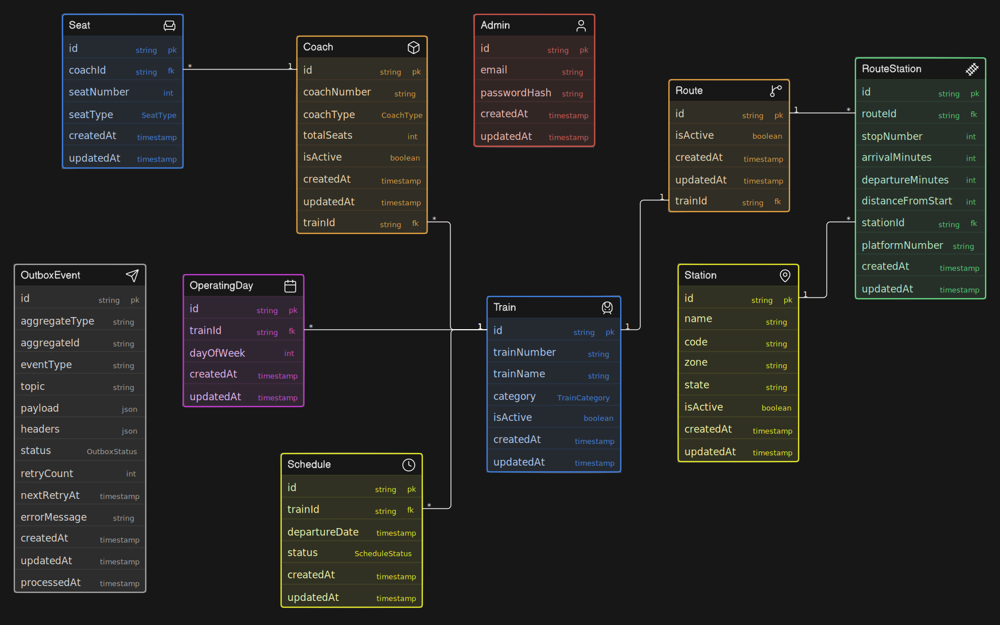
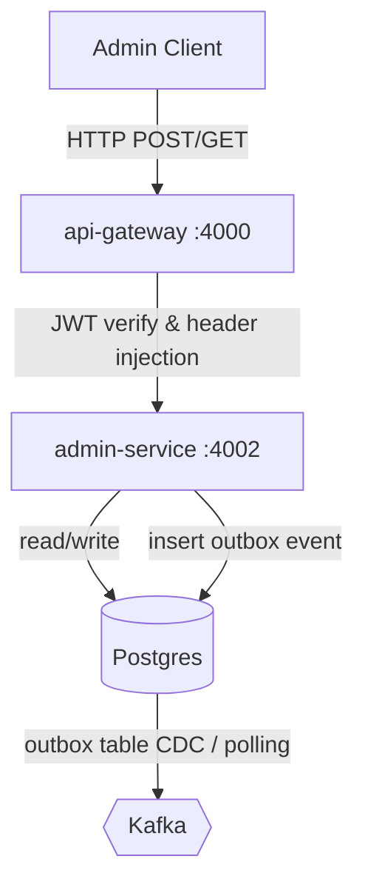

# `admin-service`

> Administrative operations, station setups, train configurations, route planning, seat layouts, and schedules for the IRCTC platform.
> Owns the train, station, coach, seat template, route, and schedule records (Postgres via Prisma), and publishes update events to Kafka using the Transactional Outbox pattern.

## ER Diagram



## Responsibilities

**Owns:**

- **Admin Authentication:** Secure admin login/logout and token validation (cookie-based verification).
- **Station Management:** Station creation, retrieval, filters, pagination, and deactivation.
- **Train Management:** Train registration, classification, active status toggling, and operating day schedules.
- **Coach Configuration:** Adding coaches to trains, validating coach type capacities (SL, CC, EC, AC_1A, AC_2A, AC_3A, AC_3E), and deletion protection.
- **Seat Template Generation:** Bulk generation of layout-specific seats based on Indian Railways berth configuration logic (Lower, Upper, Middle, Side Lower, Side Upper, etc.) and reset operations.
- **Route Planning:** Configuring sequence-based stops for trains, checking for stop number conflicts, enforcing duplicate-station prevention, maintaining a minimum of 2 stops (source & destination), and guarding against deleting routes that have active future schedules.
- **Schedule Management:** Creating and managing train journey runs, validating operating day matches, and protecting schedules from status overrides.
- **Kafka Event Logging:** Writing lifecycle events to the transactional outbox table (`StationEvents`, `TrainEvents`, `CoachEvents`, `SeatTemplateEvents`, `RouteEvents`, `ScheduleEvents`) to keep other services in sync.

## Endpoints

All administrative endpoints are mounted under `/api/v1/admin` and require JWT verification at the edge via the API Gateway. All responses use the `@irctc/http` standardized success/error JSON envelope.

### Public (unauthenticated)

| Method | Endpoint            | Body / Params         | Success                                       | Notable Errors            |
| ------ | ------------------- | --------------------- | --------------------------------------------- | ------------------------- |
| `POST` | `/admin/auth/login` | `{ email, password }` | `200 { admin }` + `admin_access_token` cookie | `401 INVALID_CREDENTIALS` |

### Authenticated (Gateway-injected headers required)

These endpoints require the `X-Admin-Id` header injected by the API gateway from a verified admin JWT cookie (`admin_access_token`).

#### Station Management

| Method  | Endpoint                                | Body / Params                                                         | Success                  | Notable Errors                                        |
| ------- | --------------------------------------- | --------------------------------------------------------------------- | ------------------------ | ----------------------------------------------------- |
| `POST`  | `/admin/stations`                       | `{ name, code, zone?, state?, isActive }`                             | `201 { station }`        | `409 STATION_ALREADY_EXISTS`                          |
| `GET`   | `/admin/stations`                       | query: `{ page?, limit?, code?, zone?, state?, isActive? }`           | `200 { data, metadata }` | `400 INVALID_INPUT`                                   |
| `GET`   | `/admin/stations/:stationId`            | path: `stationId` (UUID)                                              | `200 { station }`        | `404 STATION_NOT_FOUND`                               |
| `PATCH` | `/admin/stations/:stationId`            | path: `stationId`, body: `{ name?, code?, zone?, state?, isActive? }` | `200 { station }`        | `404 STATION_NOT_FOUND`, `409 STATION_ALREADY_EXISTS` |
| `PATCH` | `/admin/stations/:stationId/deactivate` | path: `stationId`                                                     | `200 { station }`        | `404 STATION_NOT_FOUND`                               |

#### Train & Coach Management

| Method  | Endpoint                                | Body / Params                                                                 | Success                  | Notable Errors                                                                           |
| ------- | --------------------------------------- | ----------------------------------------------------------------------------- | ------------------------ | ---------------------------------------------------------------------------------------- |
| `POST`  | `/admin/trains`                         | `{ trainNumber, trainName, category }`                                        | `201 { train }`          | `409 TRAIN_ALREADY_EXISTS`                                                               |
| `GET`   | `/admin/trains`                         | query: `{ page?, limit?, trainNumber?, category?, isActive? }`                | `200 { data, metadata }` | —                                                                                        |
| `GET`   | `/admin/trains/:trainId`                | path: `trainId`                                                               | `200 { train }`          | `404 TRAIN_NOT_FOUND`                                                                    |
| `PATCH` | `/admin/trains/:trainId`                | path: `trainId`, body: `{ trainName?, category? }`                            | `200 { train }`          | `404 TRAIN_NOT_FOUND`                                                                    |
| `PATCH` | `/admin/trains/:trainId/deactivate`     | path: `trainId`                                                               | `200 { train }`          | `404 TRAIN_NOT_FOUND`                                                                    |
| `POST`  | `/admin/trains/:trainId/operating-days` | path: `trainId`, body: `{ operatingDays: number[] }` (0=Sunday to 6=Saturday) | `200 { train }`          | `404 TRAIN_NOT_FOUND`, `409 TRAIN_OPERATING_DAYS_REFERENCED`                             |
| `GET`   | `/admin/trains/:trainId/coaches`        | path: `trainId`                                                               | `200 [{ coach }]`        | `404 TRAIN_NOT_FOUND`                                                                    |
| `POST`  | `/admin/trains/:trainId/coaches`        | path: `trainId`, body: `{ coachNumber, coachType, totalSeats }`               | `201 { coach }`          | `404 TRAIN_NOT_FOUND`, `409 COACH_ALREADY_EXISTS`, `400 INVALID_INPUT` (capacity bounds) |

#### Coach & Seat Template Configuration

| Method   | Endpoint                                | Body / Params                                                      | Success          | Notable Errors                                            |
| -------- | --------------------------------------- | ------------------------------------------------------------------ | ---------------- | --------------------------------------------------------- |
| `GET`    | `/admin/coaches/:coachId`               | path: `coachId`                                                    | `200 { coach }`  | `404 COACH_NOT_FOUND`                                     |
| `PATCH`  | `/admin/coaches/:coachId`               | path: `coachId`, body: `{ coachNumber?, coachType?, totalSeats? }` | `200 { coach }`  | `409 SEATS_ALREADY_GENERATED`, `409 COACH_ALREADY_EXISTS` |
| `DELETE` | `/admin/coaches/:coachId`               | path: `coachId`                                                    | `200 { coach }`  | `409 SEATS_ALREADY_GENERATED`                             |
| `POST`   | `/admin/coaches/:coachId/seats`         | path: `coachId` (bulk generate seats)                              | `201 { count }`  | `409 SEATS_ALREADY_GENERATED`                             |
| `GET`    | `/admin/coaches/:coachId/seats`         | path: `coachId`                                                    | `200 [{ seat }]` | `404 COACH_NOT_FOUND`                                     |
| `GET`    | `/admin/coaches/:coachId/seats/:seatId` | path: `coachId`, `seatId`                                          | `200 { seat }`   | `404 SEAT_NOT_FOUND`                                      |
| `DELETE` | `/admin/coaches/:coachId/seats`         | path: `coachId` (resets/deletes seat generation)                   | `200 { count }`  | `404 COACH_NOT_FOUND`                                     |

#### Route Configuration

| Method   | Endpoint                                | Body / Params                                                                                                              | Success                              | Notable Errors                                             |
| -------- | --------------------------------------- | -------------------------------------------------------------------------------------------------------------------------- | ------------------------------------ | ---------------------------------------------------------- |
| `POST`   | `/admin/trains/:trainId/routes`         | path: `trainId` (initiates empty route)                                                                                    | `201 { route }`                      | `409 ROUTE_ALREADY_EXISTS`                                 |
| `GET`    | `/admin/routes`                         | query: `{ page?, limit? }`                                                                                                 | `200 { data, metadata }`             | —                                                          |
| `GET`    | `/admin/routes/:routeId`                | path: `routeId`                                                                                                            | `200 { route }` (with ordered stops) | `404 ROUTE_NOT_FOUND`                                      |
| `POST`   | `/admin/routes/:routeId/stations`       | path: `routeId`, body: `{ stationId, stopNumber, arrivalMinutes?, departureMinutes?, distanceFromStart, platformNumber? }` | `201 { stop }`                       | `409 STOP_NUMBER_CONFLICT`, `409 STATION_ALREADY_ON_ROUTE` |
| `PATCH`  | `/admin/routes/:routeId/status`         | path: `routeId`, body: `{ isActive }`                                                                                      | `200 { route }`                      | `409 ROUTE_REFERENCED_BY_SCHEDULES`                        |
| `DELETE` | `/admin/routes/:routeId`                | path: `routeId` (soft-deactivates route)                                                                                   | `200 { route }`                      | `409 ROUTE_REFERENCED_BY_SCHEDULES`                        |
| `PATCH`  | `/admin/route-stations/:routeStationId` | path: `routeStationId`, body: `{ stopNumber?, arrivalMinutes?, departureMinutes?, distanceFromStart?, platformNumber? }`   | `200 { stop }`                       | `404 ROUTE_STATION_NOT_FOUND`                              |
| `DELETE` | `/admin/route-stations/:routeStationId` | path: `routeStationId` (physically removes stop)                                                                           | `200`                                | `409 ROUTE_MIN_STATIONS_REQUIRED`                          |

#### Train Schedule Management

| Method  | Endpoint                              | Body / Params                                 | Success                             | Notable Errors                                                                                               |
| ------- | ------------------------------------- | --------------------------------------------- | ----------------------------------- | ------------------------------------------------------------------------------------------------------------ |
| `POST`  | `/admin/schedules`                    | `{ trainId, departureDate }`                  | `201 { schedule }`                  | `409 TRAIN_NOT_OPERATING_ON_DAY`, `409 ROUTE_MIN_STATIONS_REQUIRED`, `409 INVALID_INPUT` (already scheduled) |
| `GET`   | `/admin/schedules`                    | query: `{ page?, limit?, trainId?, status? }` | `200 { data, metadata }`            | —                                                                                                            |
| `GET`   | `/admin/schedules/:scheduleId`        | path: `scheduleId`                            | `200 { schedule }` (with snapshots) | `404 INVALID_INPUT`                                                                                          |
| `PATCH` | `/admin/schedules/:scheduleId/status` | path: `scheduleId`, body: `{ status }`        | `200 { schedule }`                  | `404 INVALID_INPUT`                                                                                          |

#### Diagnostics & Diagnostics

| Method | Path            | Purpose / Notes                                                         |
| ------ | --------------- | ----------------------------------------------------------------------- |
| `GET`  | `/health/live`  | Liveness check (process check).                                         |
| `GET`  | `/health/ready` | Readiness check (validates database connection and Kafka connectivity). |

## Architecture at a Glance

The `admin-service` works in tandem with the `api-gateway` and database/messaging layers:



The service utilizes a layered pattern:
`Routes → Controllers → Services → Repositories → Prisma/Database`.

### The Transactional Outbox Pattern

To ensure eventual consistency across microservices (e.g., synchronizing station/train databases to scheduling, search, or booking upstreams) without failing on distributed transactions:

1. Every write operation (e.g. creating a train or route station) writes to its target table AND registers an event payload into the `Outbox` table within the **same Postgres database transaction**.
2. A separate background worker/poller periodically reads from the `Outbox` table and publishes the messages to Kafka, marking them as processed.
3. This guarantees **at-least-once delivery** of critical domain updates to Kafka.

## Configuration

Validated by `@t3-oss/env-core` at startup.

| Variable                | Required | Default          | Description                                      |
| ----------------------- | -------- | ---------------- | ------------------------------------------------ |
| `PORT`                  | no       | `4002`           | Port that the Express server listens on.         |
| `NODE_ENV`              | no       | `development`    | Environment status.                              |
| `DATABASE_URL`          | **yes**  | —                | Prisma Postgres database connection URI.         |
| `JWT_SECRET`            | **yes**  | —                | SHA-256 secret key to sign/verify admin JWTs.    |
| `JWT_ACCESS_EXPIRES_IN` | no       | `15m`            | Expiration lifespan for admin session tokens.    |
| `SERVICE_NAME`          | no       | `admin-service`  | Service identifier tag for logs/telemetry.       |
| `KAFKA_BROKERS`         | no       | `localhost:9092` | Comma-separated list of Kafka broker hosts.      |
| `KAFKA_CLIENT_ID`       | no       | `admin-service`  | Client identifier registered with Kafka brokers. |

## Local Development & Setup

Make sure you have infrastructure dependencies running (via the root-level `docker-compose.yml` or local stack).

### 1. Set Up Environment File

Create a local `.env` file from the example:

```bash
cp apps/admin-service/.env.example apps/admin-service/.env
```

### 2. Install Dependencies & Generate Client

Run from the root of the monorepo:

```bash
pnpm install
pnpm --filter admin-service prisma generate
pnpm --filter admin-service prisma migrate dev
```

### 3. Seed Admin User

Seed database default admin credentials:

```bash
pnpm --filter admin-service seed
```

### 4. Start the Service

```bash
pnpm --filter admin-service dev
```

The server will start listening at `http://localhost:4002`.

### 5. Running Gateway Tests

To execute tests via the API Gateway, configure your REST client to target `http://localhost:4000/api/v1` and use [api-test.http](file:///d:/dev/distributed_railway_booking_platform/apps/admin-service/api-test.http).
