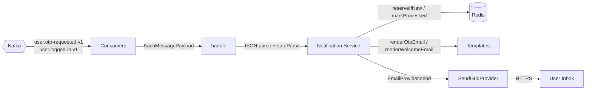
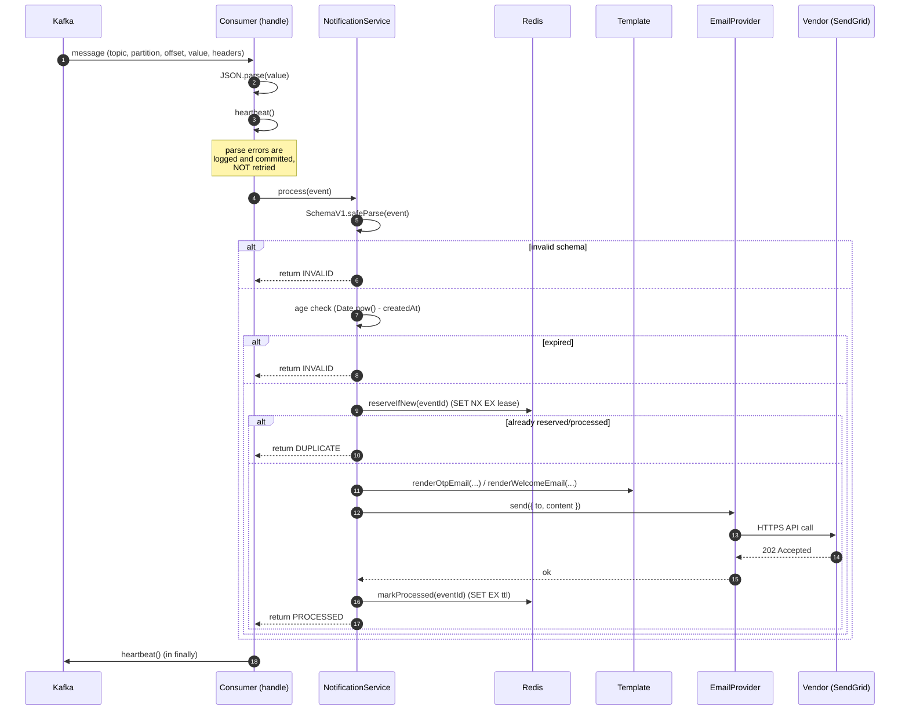

# `notification-service`

> Transactional email delivery for the IRCTC platform.
> Consumes user lifecycle events from Kafka and dispatches OTP, password-reset,
> and welcome-back emails via a pluggable `EmailProvider` (SendGrid today).

## Responsibilities

**Owns:** Kafka consumer loops for `user.otp-requested.v1` and
`user.logged-in.v1`, Zod-validated event ingestion, exactly-once email
dispatch (Redis idempotency), event-age expiration (stale messages are
discarded), email template rendering (text + HTML), email provider
pluggability via the `EmailProvider` Strategy interface.

## Endpoints

This service is **headless** — it does **not** run an HTTP server, has no
Express app, and exposes no `/api/v1` routes. The only outbound
network surfaces it owns are:

- **Kafka consumer connections** to `user.otp-requested.v1` and
  `user.logged-in.v1` (see [Kafka contract](#kafka-contract)).
- **An exec-style health probe** at `src/healthcheck.ts`. It `PING`s
  Redis and exits `0` (healthy) or `1` (unhealthy) so Kubernetes can
  exec into the pod and report liveness/readiness without an HTTP
  listener. It deliberately does not run a long-lived server: a
  notification worker that isn't consuming is just a stopped worker.

There is no `/health/live` or `/health/ready` route in this service.
Probes are wired to `node src/healthcheck.ts` (or the container's
equivalent) by the orchestrator.

## Architecture at a glance



Layered: `Consumers → Services → Templates → EmailProvider → Vendor SDK`.
The service has no database of its own — Redis is the only stateful
dependency and it is used **exclusively** for idempotency leases.

## How a message flows



If `emailProvider.send` throws, the reservation is **released** so the
next consumer redelivery (or replica) can retry. A successful send
transitions the key from `PROCESSING` → `PROCESSED` with the longer TTL.

## Idempotency & exactly-once semantics

`@irctc/redis`'s `IdempotencyRepository` enforces exactly-once email
delivery using a two-state Redis key per `eventId`:

| State        | Set by            | TTL env var                            | Default | Job                                                                                                                                                                                                                         |
| ------------ | ----------------- | -------------------------------------- | ------- | --------------------------------------------------------------------------------------------------------------------------------------------------------------------------------------------------------------------------- |
| `PROCESSING` | `reserveIfNew()`  | `IDEMPOTENCY_PROCESSING_LEASE_SECONDS` | 5 min   | **In-flight lease.** A consumer has claimed the message. If this consumer crashes, the lease auto-expires and another consumer (or this one on restart) can retry. Must exceed the worst-case SendGrid call + retry window. |
| `PROCESSED`  | `markProcessed()` | `IDEMPOTENCY_TTL_SECONDS`              | 7 d     | **Deduplication window.** The email was sent. Any future redelivery within this window is a no-op.                                                                                                                          |
| _deleted_    | `release()`       | —                                      | —       | A send failed; the next redelivery may try again.                                                                                                                                                                           |

The keyspace is namespaced by topic (e.g. `user.otp-requested.v1:<eventId>`,
`user.logged-in.v1:<eventId>`) so OTP and welcome events never collide.

`release()` is implemented as a Lua `GET`-then-`DEL` script that only
deletes the key when the current value is still `PROCESSING`. This
prevents a slow failure path from accidentally clobbering a
`PROCESSED` marker left by a faster replica.

### Why 7 days for the processed window

The 7-day `PROCESSED` TTL is the **maximum realistic Kafka redelivery
window**, not a business retention policy. Three things bound it:

- **Kafka offset retention** (default 7 days) bounds how long a stale
  consumer group's committed offsets stay valid. Past that, the
  consumer group resets and we'd start over.
- **Kafka log retention** bounds how long the message itself exists on
  the broker. Once deleted, redelivery is physically impossible and
  the dedup key becomes irrelevant.
- **Manual replays** generate a fresh `eventId` (new UUID), so they
  never collide with old dedup keys.

Setting this shorter (say, 1 hour) is unsafe: a crashed consumer that
comes back hours later would redeliver an already-sent event, the
`PROCESSED` key would be gone, and the user would get the same OTP or
welcome email twice — a user-visible, embarrassing, and (at scale)
costly duplicate. 7 days = "Kafka's worst case + a small margin."

### Why 5 minutes for the processing lease

The lease is the **opposite** trade-off: it should be short enough
that a crashed consumer doesn't block the partition for hours, but
long enough that a healthy consumer's `markProcessed()` always wins
the race against the lease expiry. SendGrid calls typically complete
in seconds; the consumer runner's retry cycle adds maybe a minute. 5
minutes is "way more than the send needs, way less than the time ops
would tolerate a stuck partition."

## Event age expiration

Events carry a per-message TTL on the wire:

- **`OTPRequestedV1`** — `createdAt` + `ttlSeconds` (300 s for
  registration, 600 s for password-reset, both set by `user-service`).
- **`UserLoggedInV1`** — `loggedInAt` + service-level
  `WELCOME_TTL_SECONDS` (3600 s).

If `Date.now() - eventTime > ttl` when the message is processed, the
service logs and returns `INVALID` — the message is acknowledged and
discarded. This means a user whose OTP arrives after they've already
verified it does not receive a confusing "your new code is 123456" email
hours later, and a stale login notification won't fire long after the
session was used.

## Templates

All copy lives in `src/templates/`, decoupled from the services that
fire emails. Each template exposes a single `render*(input):
SendEmailOptions` function that returns the `{ to, content: { subject,
text, html } }` envelope. `welcome-email.template.ts` HTML-escapes
user-supplied `firstName`/`lastName` before interpolating to prevent
HTML/XSS injection through event payloads.

| File                        | Triggered by     | Subject                                                                |
| --------------------------- | ---------------- | ---------------------------------------------------------------------- |
| `otp-email.template.ts`     | `OTPRequestedV1` | _"Your IRCTC One-Time Password (OTP)"_ / _"Reset your IRCTC password"_ |
| `welcome-email.template.ts` | `UserLoggedInV1` | _"Welcome back, {firstName}"_                                          |

## Email provider abstraction

`src/email/email-provider.ts` defines the Strategy interface. The
current concrete `EmailProvider` is `SendGridProvider`
(`@sendgrid/mail`). Adding a new vendor means:

1. Implement `EmailProvider.send({ to, content })`.
2. Register the new vendor in `EmailVendor` (`src/email/provider.factory.ts`).
3. Extend `EMAIL_VENDOR` in `src/config/env.ts`.

`EmailProviderFactory.create()` instantiates the right strategy from
`env.EMAIL_VENDOR`. The container wires it through constructor DI.

## Kafka contract

| Topic                   | Schema           | Producer       | Consumer group (this service)           | Purpose                         |
| ----------------------- | ---------------- | -------------- | --------------------------------------- | ------------------------------- |
| `user.otp-requested.v1` | `OTPRequestedV1` | `user-service` | `notification-service-otp-consumer`     | Send registration / reset OTPs. |
| `user.logged-in.v1`     | `UserLoggedInV1` | `user-service` | `notification-service-welcome-consumer` | Send a "Welcome back" email.    |

Consumer group IDs are exported from `@irctc/contracts` as
`CONSUMER_GROUPS.NOTIFICATION_OTP` and
`CONSUMER_GROUPS.NOTIFICATION_WELCOME` — never hard-code them.

Both consumers use `RetryPolicies.aggressive()` from `@irctc/kafka` and
are wrapped in `KafkaConsumerRunner` which propagates OpenTelemetry
trace context from message headers.

## Security

- **No plaintext credentials in events.** OTPs arrive hashed in Redis
  (`user-service`) and ride Kafka **in plaintext** because the OTP itself
  _is_ the credential the user will type. This is by design — the event
  is the trigger to email the user the OTP they need to verify.
- **Welcome email only on `user.logged-in.v1`.** A compromised
  `notification-service` cannot impersonate a user; it can only spam
  emails to addresses the producer chose to publish.
- **HTML escaping** in `welcome-email.template.ts` for any
  user-controlled string interpolated into the HTML body.
- **`SendGrid` API key** is read from `SENDGRID_API_KEY`. The default
  `SG.mock_key` is only suitable for local dev where real sends are
  short-circuited by SendGrid's mock mode.
- **Idempotency leases** prevent a malicious redelivery loop from
  re-firing the same email.

## Failure modes

- **SendGrid is down** → `emailProvider.send` throws; the consumer's
  retry policy reattempts with backoff. Once retries are exhausted the
  consumer crashes; the orchestrator restarts it and Kafka redelivers
  the uncommitted offset.
- **Redis is down** → `reserveIfNew` throws; the consumer retries.
  The exec-style health probe exits non-zero, K8s marks the pod
  NotReady.
- **Kafka is down** → consumer cannot subscribe; consumers will
  reconnect with backoff. Events accumulate on the broker and are
  replayed on restart (the idempotency store prevents double-send).
- **Malformed payload** (`JSON.parse` or schema validation fails) →
  logged as a poison message, offset is committed, no retry. This
  prevents a single bad message from blocking the partition forever.
- **Stale event** (older than its TTL) → logged, offset is committed,
  no email sent.

### Graceful shutdown order

`SIGINT` / `SIGTERM` / `unhandledRejection` / `uncaughtException` all
run `shutdown(signal, exitCode)`, which executes in this order:

1. `NotificationContainer.disconnect()` — stop Kafka consumer loops
2. `disconnectKafka()` — close Kafka producer client
3. `disconnectRedis()` — close Redis client
4. `shutdownTelemetry()` — flush OTel exporter
5. `process.exit`

Each step is wrapped in a 5 s `Promise.race` timeout via `withTimeout`;
a single failure does not skip the rest.

## Configuration

Validated by `@t3-oss/env-core` at boot; missing values abort startup.

| Var                                    | Required | Default                 | Purpose                                                                |
| -------------------------------------- | -------- | ----------------------- | ---------------------------------------------------------------------- |
| `PORT`                                 | no       | `4002`                  | HTTP port (used by the platform probe gateway).                        |
| `NODE_ENV`                             | no       | `development`           | Controls dev-only caching of the Redis client.                         |
| `REDIS_URL`                            | **yes**  | —                       | `redis://` or `rediss://`.                                             |
| `SERVICE_NAME`                         | no       | `notification-service`  | Tag for logs and OTel resource.                                        |
| `OTEL_EXPORTER_OTLP_ENDPOINT`          | no       | `http://localhost:4318` | OTLP HTTP collector base URL.                                          |
| `OTEL_DEBUG`                           | no       | `false`                 | Verbose OTel logging.                                                  |
| `LOKI_HOST`                            | no       | —                       | Optional Loki push URL.                                                |
| `KAFKA_BROKERS`                        | no       | `localhost:9092`        | Comma-separated broker list.                                           |
| `KAFKA_CLIENT_ID`                      | no       | `notification-service`  | Kafka client id.                                                       |
| `EMAIL_VENDOR`                         | no       | `SENDGRID`              | Selects the `EmailProvider` strategy.                                  |
| `SENDGRID_API_KEY`                     | no       | `SG.mock_key`           | SendGrid API key.                                                      |
| `SENDGRID_SENDER`                      | no       | `no-reply@example.com`  | Verified `from` address.                                               |
| `WELCOME_TTL_SECONDS`                  | no       | `3600`                  | Max age of a `UserLoggedInV1` event before it's discarded.             |
| `IDEMPOTENCY_TTL_SECONDS`              | no       | `604800` (7 d)          | TTL of `PROCESSED` markers in Redis.                                   |
| `IDEMPOTENCY_PROCESSING_LEASE_SECONDS` | no       | `300` (5 m)             | TTL of `PROCESSING` lease. Must exceed worst-case send + retry window. |

## Local development — Docker Compose (recommended)

The repo's `docker-compose.yml` stands up every dependency the service
needs. Run from the repo root:

```bash
# Start Postgres, Redis, and Kafka (KRaft mode) + their UIs and a topic-init sidecar
docker compose up -d

```

### What `docker compose up` gives you

| Service                | Host port       | Container                    | Purpose                                                                                                                                                                 |
| ---------------------- | --------------- | ---------------------------- | ----------------------------------------------------------------------------------------------------------------------------------------------------------------------- |
| `kafka`                | `9092`, `29092` | `irctc-kafka`                | Broker in KRaft mode. `9092` is for the **host** (`pnpm dev`), `29092` is for **other containers**.                                                                     |
| `kafka-ui`             | `8080`          | `irctc-kafka-ui`             | Browse topics, consumer groups, and messages.                                                                                                                           |
| `kafka-init`           | —               | `irctc-kafka-init`           | One-shot sidecar that pre-creates the `user.*` topics on first boot.                                                                                                    |
| `redis`                | `6379`          | `irctc-redis`                | Idempotency leases and processed markers.                                                                                                                               |
| `redis-insight`        | `8001`          | `irctc-redis-insight`        | Browse Redis keys and TTLs.                                                                                                                                             |
| `notification-service` | —               | `irctc-notification-service` | The worker itself, started by Compose. No host port is published — the worker has no HTTP listener; only Kafka and Redis are reachable from inside the Compose network. |

> **Heads-up on `KAFKA_BROKERS`.** The dev script runs on the **host**,
> so it talks to Kafka via `localhost:9092`. The `notification-service`
> container inside Compose uses `irctc-kafka:29092` — that's already
> wired in `docker-compose.yml`. Don't mix them up.

Tear down:

```bash
docker compose down      # stop, keep volumes
docker compose down -v   # stop, wipe all data (full reset)
```

### Smoke test

```bash
# 1. Send an OTP request through user-service
curl -i -X POST http://localhost:4001/api/v1/auth/send-otp \
  -H "Content-Type: application/json" \
  -d '{"firstName":"John","lastName":"Doe","email":"smoke@example.com",
       "password":"Password@123","confirmPassword":"Password@123"}'

# 2. Watch the consumer drain the topic
docker compose logs -f notification-service
# or, running on the host:
pnpm --filter notification-service dev

# 3. Confirm the idempotency key exists
docker compose exec redis redis-cli KEYS 'user.otp-requested.v1:*'
```

For a complete scripted walkthrough that exercises both topics, open
`apps/user-service/api-test.http` with the VS Code REST Client
extension and execute the registration + login requests — they both
publish events that this service consumes.

## Local development — manual (no Docker)

If you'd rather point at managed services (Upstash, Confluent Cloud) or
local installs:

```bash
# 1. Make sure Redis and Kafka are reachable
#    e.g. one-off containers for the ones you don't have locally:
docker run -d --name redis -p 6379:6379 redis:7-alpine

docker run -d --name kafka -p 9092:9092 \
  -e KAFKA_CFG_NODE_ID=0 \
  -e KAFKA_CFG_PROCESS_ROLES=controller,broker \
  -e KAFKA_CFG_CONTROLLER_QUORUM_VOTERS=0@localhost:9093 \
  -e KAFKA_CFG_LISTENERS=PLAINTEXT://:9092,CONTROLLER://:9093 \
  -e KAFKA_CFG_ADVERTISED_LISTENERS=PLAINTEXT://localhost:9092 \
  -e KAFKA_CFG_CONTROLLER_LISTENER_NAMES=CONTROLLER \
  -e KAFKA_CFG_LISTENER_SECURITY_PROTOCOL_MAP=CONTROLLER:PLAINTEXT,PLAINTEXT:PLAINTEXT \
  -e CLUSTER_ID=MkU3OEVBNTcwNTJENDM2Qk \
  confluentinc/cp-kafka:7.8.0

# 2. Pre-create the topics (the producer refuses to auto-create)
kafka-topics --bootstrap-server localhost:9092 --create --if-not-exists \
  --topic user.otp-requested.v1 --partitions 3 --replication-factor 1
kafka-topics --bootstrap-server localhost:9092 --create --if-not-exists \
  --topic user.logged-in.v1 --partitions 3 --replication-factor 1

# 3. From the repo root
pnpm install
cp apps/notification-service/.env.example apps/notification-service/.env
# edit .env: set REDIS_URL / KAFKA_BROKERS / SENDGRID_API_KEY

# 4. Start the worker
pnpm --filter notification-service dev
```

## See also

- `packages/contracts` — versioned event schemas (Zod) and
  `CONSUMER_GROUPS` / `KAFKA_TOPICS` constants.
- `packages/kafka` — `KafkaConsumerRunner`, retry policies, and
  OTel header propagation shared by every service.
- `packages/redis` — `IdempotencyRepository` (the lease + processed
  state machine described above).
- `apps/user-service` — the only producer of events this service
  consumes.
- `docker-compose.yml` — the local stack this README references.
