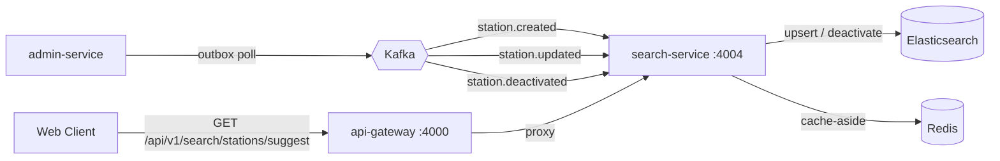

# `search-service`

> Read-only station discovery layer for the IRCTC platform. Projects admin-managed station lifecycle events into an Elasticsearch index optimised for prefix-style autocomplete, and fronts those reads with a short-TTL Redis cache.

## Responsibilities

**Owns:**

- **Station projection:** consuming `StationCreatedV1`, `StationUpdatedV1`, and `StationDeactivatedV1` events published by `admin-service` and projecting them into the `stations` Elasticsearch index.
- **Suggest endpoint:** serving `GET /api/v1/search/stations/suggest` with rank-ordered fuzzy matches against `code`, `name`, `city`, and `state` fields.
- **Idempotent consumption:** a two-phase Redis idempotency lease (`reserveIfNew` → `markProcessed`, with `release` on failure) deduplicates replays across consumer groups.
- **Read caching:** cache-aside Redis layer keyed by `(q, limit)` so hot suggestion queries never reach Elasticsearch.
- **Bounded readiness:** in-process readiness probes for Elasticsearch, Redis, and Kafka, each capped at 5 s so a hung dependency cannot stall the k8s readiness response.

**Does not own:**

- Authoritative station data — `admin-service` owns it and is the source of truth for the projection.
- Train, schedule, or inventory data — these are out of scope.
- Auth — search is mounted behind the API gateway in production; this service issues no tokens.

## Endpoints

All endpoints use the `@irctc/http` standardised success/error JSON envelope. Mounted under `/api/v1` and exposed at `:4004` directly or behind the gateway at `:4000/api/v1/search`.

### Public

| Method | Endpoint                   | Query                                        | Success                             | Notable Errors                             |
| ------ | -------------------------- | -------------------------------------------- | ----------------------------------- | ------------------------------------------ |
| `GET`  | `/search/stations/suggest` | `q` (2–64 chars), `limit` (1–25, default 10) | `200 { data: StationSuggestion[] }` | `400 INVALID_INPUT` (`q` length / `limit`) |

### Diagnostics

| Method | Path            | Purpose / Notes                                                                          |
| ------ | --------------- | ---------------------------------------------------------------------------------------- |
| `GET`  | `/health/live`  | Liveness check (process check).                                                          |
| `GET`  | `/health/ready` | Readiness check (probes Elasticsearch, Redis, and Kafka — each bounded at 5 s).          |
| `GET`  | `/`             | Root banner listing available route prefixes; convenient `kubectl exec curl` smoke test. |

### StationSuggestion

```ts
interface StationSuggestion {
  stationId: string; // UUID
  code: string; // short station code (e.g. "NDLS")
  name: string; // canonical station name
  city: string; // nearest city
  state: string; // state
  score: number; // relevance score from Elasticsearch
}
```

## Kafka Consumer Subscriptions

| Topic                          | Consumer group                                | Handler             |
| ------------------------------ | --------------------------------------------- | ------------------- |
| `admin.station-created.v1`     | `search-service-station-created-consumer`     | `handleCreated`     |
| `admin.station-updated.v1`     | `search-service-station-updated-consumer`     | `handleUpdated`     |
| `admin.station-deactivated.v1` | `search-service-station-deactivated-consumer` | `handleDeactivated` |

Each topic gets its own consumer group so partition progress is independent and consumers subscribe in parallel. Each handler parses the payload through its versioned Zod schema in `@irctc/contracts`, then projects into Elasticsearch through `StationSearchRepository`.

## Architecture at a Glance

The projection flows from `admin-service` to `search-service` via Kafka; the read path flows from the API gateway to `search-service`:



The service uses the standard layered pattern:

```
Routes → Controllers → Services → Repositories → Elasticsearch / Redis / Kafka
```

- **Routes** wire `validateQuery(stationSuggestQuerySchema)` ahead of the controller.
- **Controller** is a thin HTTP layer — no try/catch, `errorHandler` middleware renders the `ApiError`.
- **Services** carry business logic: cache-aside read in `SearchService`, idempotent projection in `StationProjectionService`.
- **Repository** is the only layer that touches Elasticsearch.

### Idempotency Model

`StationProjectionService` shares one `dispatch` helper across all three handlers:

1. `reserveIfNew(eventId)` — atomic Redis `SET NX` with a `PROCESSING` lease.
2. If the lease is acquired, the corresponding `applyUpsert` / `applyDeactivated` runs against Elasticsearch.
3. On success, `markProcessed(eventId)` flips the key to the processed TTL.
4. On failure, `release(eventId)` deletes the lease so the retry can re-acquire it.

`SyntaxError` from JSON parsing is treated as non-retryable and swallowed; everything else rethrows so `KafkaConsumerRunner` can apply the configured retry policy.

## Configuration

Validated by `@t3-oss/env-core` at startup. Set in `.env` or your platform's secret manager.

| Variable                               | Required | Default                      | Description                                                                      |
| -------------------------------------- | -------- | ---------------------------- | -------------------------------------------------------------------------------- |
| `PORT`                                 | no       | `4004`                       | Port that the Express server listens on.                                         |
| `NODE_ENV`                             | no       | `development`                | Environment status.                                                              |
| `ELASTICSEARCH_NODE`                   | no       | `http://localhost:9200`      | Elasticsearch HTTP endpoint.                                                     |
| `ELASTICSEARCH_USERNAME`               | no       | `elastic`                    | Elasticsearch basic-auth user.                                                   |
| `ELASTICSEARCH_PASSWORD`               | no       | `your_password`              | Elasticsearch basic-auth password.                                               |
| `REDIS_URL`                            | **yes**  | —                            | Redis connection URI (`redis://` or `rediss://`). Used for idempotency + cache.  |
| `KAFKA_BROKERS`                        | no       | `localhost:9092`             | Comma-separated list of Kafka broker hosts.                                      |
| `KAFKA_CLIENT_ID`                      | no       | `search-service`             | Client identifier registered with Kafka brokers.                                 |
| `SERVICE_NAME`                         | no       | `search-service`             | Service identifier tag for logs/telemetry.                                       |
| `INVENTORY_GRPC_URL`                   | no       | `localhost:50051`            | Reserved for future inventory gRPC calls; not used by the search endpoint today. |
| `INVENTORY_UPSTREAM`                   | no       | `localhost:4003`             | Reserved for future inventory REST calls.                                        |
| `STATION_INDEX_NAME`                   | no       | `stations`                   | Elasticsearch index name for the station projection.                             |
| `STATION_INDEX_RECREATE`               | no       | `false`                      | Drop and recreate the stations index on bootstrap (local resets only).           |
| `IDEMPOTENCY_PROCESSING_LEASE_SECONDS` | no       | `60`                         | TTL of the in-flight `PROCESSING` lease — must exceed worst-case ES write time.  |
| `IDEMPOTENCY_TTL_SECONDS`              | no       | `86400`                      | TTL of the `PROCESSED` marker — the dedup window for replayed events.            |
| `IDEMPOTENCY_KEYSPACE`                 | no       | `search:station-idempotency` | Redis keyspace prefix for idempotency keys.                                      |
| `SUGGEST_CACHE_TTL_SECONDS`            | no       | `60`                         | TTL for cached `stations/suggest` responses.                                     |
| `SUGGEST_CACHE_KEY_PREFIX`             | no       | `cache:station-suggest`      | Redis keyspace prefix for cached suggestion entries.                             |
| `OTEL_EXPORTER_OTLP_ENDPOINT`          | no       | `http://localhost:4318`      | OpenTelemetry OTLP exporter endpoint.                                            |
| `OTEL_DEBUG`                           | no       | `false`                      | Enable OpenTelemetry debug logging.                                              |
| `LOKI_HOST`                            | no       | —                            | Optional Loki push endpoint for log shipping.                                    |

## Local Development & Setup

Make sure you have infrastructure dependencies running (via the root-level `docker-compose.yml` or local stack). The service needs **Elasticsearch**, **Redis**, and **Kafka** reachable.

### 1. Set Up Environment File

Create a local `.env` file from the example:

```bash
cp "apps/search service/.env.example" "apps/search service/.env"
```

### 2. Install Dependencies

Run from the root of the monorepo:

```bash
pnpm install
```

### 3. Start the Service

```bash
pnpm --filter search-service dev
```

The server starts listening at `http://localhost:4004`. The stations Elasticsearch index is created on first bootstrap (and recreated when `STATION_INDEX_RECREATE=true`).

### 4. Smoke Test the Suggest Endpoint

```bash
curl "http://localhost:4004/api/v1/search/stations/suggest?q=ndl&limit=5"
```

For a fuller end-to-end exercise, point an HTTP client at `http://localhost:4000/api/v1` and use the merged API Gateway routes — see [`api-gateway/README.md`](../api-gateway/README.md).
