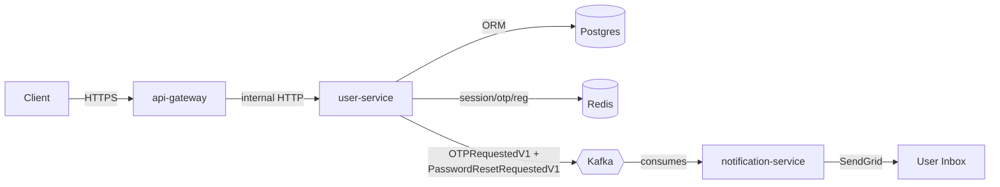
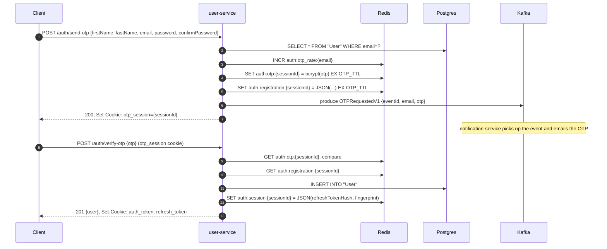
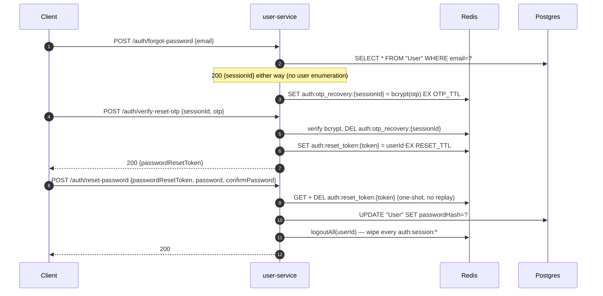
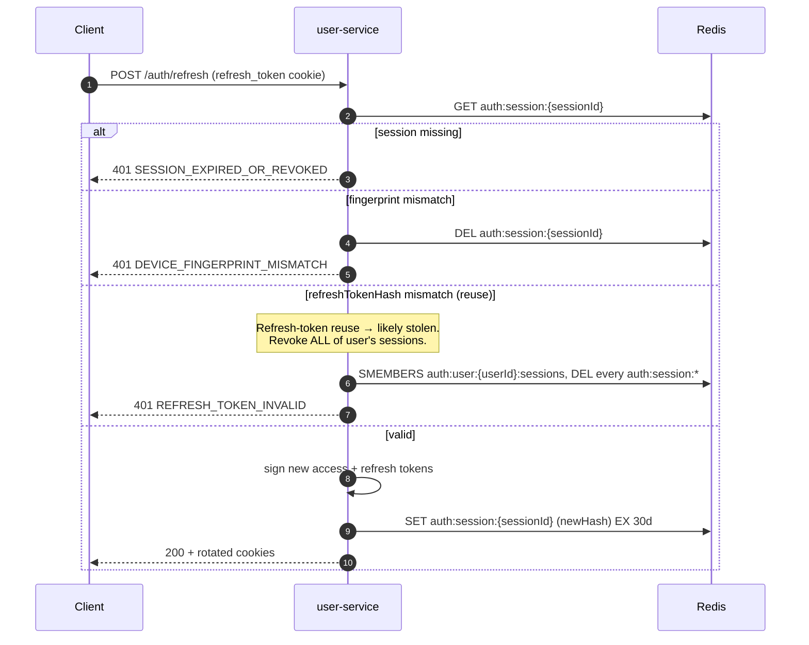

# `user-service`

> Authentication, session, registration, and password recovery for the IRCTC platform.
> Owns the user record (Postgres), session/OTP state (Redis), and publishes
> `OTPRequestedV1` and `PasswordResetRequestedV1` to Kafka. Email delivery is
> `notification-service`'s job.

---

## Responsibilities

**Owns:** registration (with email verification), login, JWT access/refresh token
issuance with rotation and reuse detection, multi-device session management,
two-phase password recovery (forgot-password → OTP → reset token → reset), Redis
session/OTP storage, producing OTP and password-reset events to Kafka.

**Does NOT own:** email delivery (notification-service), profile-update
authorization (api-gateway and resource services), global token blacklists.

---

## Endpoints

All under `/api/v1`. All responses use the `@irctc/http`
`successResponse` / `errorResponse` envelope. Errors carry a `code` from
`src/utils/errors/errorCodes.ts`.

### Public (unauthenticated)

| Method | Endpoint                 | Body / params                                               | Success                                                                   | Notable errors                                                                     |
| ------ | ------------------------ | ----------------------------------------------------------- | ------------------------------------------------------------------------- | ---------------------------------------------------------------------------------- |
| `POST` | `/auth/send-otp`         | `{ firstName, lastName, email, password, confirmPassword }` | `200`, `Set-Cookie: otp_session={sessionId}`                              | `409 USER_ALREADY_EXISTS`, `429 RATE_LIMIT_EXCEEDED`, `502 KAFKA_PUBLISH_FAILED`   |
| `POST` | `/auth/verify-otp`       | `{ otp }` + `otp_session` cookie                            | `201 {user}` + `auth_token` + `refresh_token` cookies; clears otp_session | `400 OTP_INVALID`, `404 OTP_EXPIRED`, `429 OTP_LOCKED`                             |
| `POST` | `/auth/login`            | `{ email, password }`                                       | `200 {user}` + `auth_token` + `refresh_token` cookies                     | `401 INVALID_CREDENTIALS`                                                          |
| `POST` | `/auth/refresh`          | `refresh_token` cookie                                      | `200 {user}` + rotated auth cookies                                       | `401 REFRESH_TOKEN_*`, `DEVICE_FINGERPRINT_MISMATCH`, `SESSION_EXPIRED_OR_REVOKED` |
| `POST` | `/auth/forgot-password`  | `{ email }`                                                 | `200 {sessionId}` (constant-time — same for unknown email)                | `429 RATE_LIMIT_EXCEEDED`                                                          |
| `POST` | `/auth/verify-reset-otp` | `{ sessionId, otp }`                                        | `200 {passwordResetToken}` (short-lived bearer)                           | `400 OTP_INVALID`, `404 OTP_EXPIRED`, `429 OTP_LOCKED`                             |
| `POST` | `/auth/reset-password`   | `{ passwordResetToken, password, confirmPassword }`         | `200` + clears all active sessions for that user                          | `404 RESET_TOKEN_INVALID_OR_EXPIRED`                                               |

### Authenticated (`auth_token` cookie required)

| Method   | Endpoint                    | Body / params                              | Success                                                                                | Errors                          |
| -------- | --------------------------- | ------------------------------------------ | -------------------------------------------------------------------------------------- | ------------------------------- |
| `GET`    | `/auth/sessions`            | —                                          | `200 [{ sessionId, fingerprint, createdAt, lastUsedAt, expiresAt }]` (no token hashes) | `401 *`                         |
| `DELETE` | `/auth/sessions/:sessionId` | path: `sessionId`                          | `200`                                                                                  | `403 SESSION_OWNERSHIP_INVALID` |
| `POST`   | `/auth/logout`              | `refresh_token` cookie                     | `200` + clears both auth cookies                                                       | `401 *`                         |
| `POST`   | `/auth/logout-all`          | `refresh_token` cookie                     | `200` + clears both auth cookies                                                       | `401 *`                         |
| `GET`    | `/users/me`                 | —                                          | `200 {user}`                                                                           | `404 USER_NOT_FOUND`            |
| `PUT`    | `/users/me`                 | `{ firstName?, lastName? }` (at least one) | `200 {user}`                                                                           | `400 INVALID_INPUT`             |

### Health

| Method | Path            | Notes                                                                          |
| ------ | --------------- | ------------------------------------------------------------------------------ |
| `GET`  | `/health/live`  | Liveness — always 200 if the process is up.                                    |
| `GET`  | `/health/ready` | Readiness — 200 only when Postgres, Redis, and Kafka producer are all healthy. |

### Cookies

| Cookie          | Value             | Attributes                                                                                 |
| --------------- | ----------------- | ------------------------------------------------------------------------------------------ |
| `auth_token`    | JWT access token  | `HttpOnly`, `SameSite=Strict`, `Secure` in prod, lifetime = `JWT_ACCESS_EXPIRES_IN` (15 m) |
| `refresh_token` | JWT refresh token | `HttpOnly`, `SameSite=Strict`, `Secure` in prod, lifetime = `JWT_REFRESH_EXPIRES_IN` (7 d) |
| `otp_session`   | UUID session id   | `HttpOnly`, `SameSite=Strict`, lifetime = `OTP_TTL` (5 m)                                  |

---

## Architecture at a glance



Layered: `Routes → Controllers → Services → Repositories → Prisma/Redis/Kafka`.
`user-service` is the only writer to the `User` table and the only thing that
knows the password hash — Kafka events carry no credentials.

---

## Registration flow



If `producer.send` rejects **after** Redis accepts the OTP, the service deletes
the Redis keys and returns `502 KAFKA_PUBLISH_FAILED` — the user is never told
"OTP sent" unless the event was durably enqueued.

---

## Password recovery flow

Three stages: prove you own the inbox → get a short-lived bearer token → perform
the reset. The bearer token is single-purpose and self-destructs on use.



---

## Refresh token rotation & reuse detection



Every successful refresh issues a new refresh token and updates the stored
`sha256` hash. A previously-valid token whose hash is no longer in Redis is
treated as a theft signal — every session for that user is destroyed.

---

## Redis data model

All keys are prefixed `auth:*` so ops can grep, scan, and ACL them as one
bucket. Source of truth: `src/utils/constants/redis-keys.ts`.

| Key pattern                        | Type             | TTL            | Purpose                                                                                             |
| ---------------------------------- | ---------------- | -------------- | --------------------------------------------------------------------------------------------------- |
| `auth:otp_rate:{email}`            | int              | 1 h sliding    | Rate-limit: max 5 OTP-send requests per email per hour.                                             |
| `auth:otp:{sessionId}`             | bcrypt           | 5 min          | The actual registration OTP, hashed.                                                                |
| `auth:otp_attempts:{sessionId}`    | int              | 5 min          | Brute-force guard on registration OTP verify (5 wrong → delete OTP, return 429).                    |
| `auth:registration:{sessionId}`    | JSON             | 5 min          | Form data (name, email, **hashed** password) between send-otp and verify-otp.                       |
| `auth:otp_recovery:{sessionId}`    | bcrypt           | 5 min          | Recovery OTP for forgot-password.                                                                   |
| `auth:otp_recovery_attempts:{sid}` | int              | 5 min          | Brute-force guard on recovery OTP verify.                                                           |
| `auth:reset_target:{sessionId}`    | JSON             | 5 min          | `{userId, email}` the recovery OTP unlocks. Deleted when OTP is consumed.                           |
| `auth:reset_token:{token}`         | string           | 10 min         | One-shot bearer token: trades "knows the OTP" for "can change the password". Self-destructs on use. |
| `auth:session:{sessionId}`         | JSON             | 30 d           | Server-side session: userId, fingerprint, `sha256(refreshToken)`, timestamps.                       |
| `auth:user:{userId}:sessions`      | set of sessionId | refreshed 30 d | Per-user index of active sessions; enables multi-device listing and "log out everywhere".           |

---

## Kafka contract

| Topic                              | Schema                                 | Producer            | Consumer               | Purpose                                         |
| ---------------------------------- | -------------------------------------- | ------------------- | ---------------------- | ----------------------------------------------- |
| `user.otp-requested.v1`            | `OTPRequestedV1` in `@irctc/contracts` | `OtpEventPublisher` | `notification-service` | Tell the email pipeline to send an OTP.         |
| `user.password-reset-requested.v1` | `PasswordResetRequestedV1`             | `OtpEventPublisher` | `notification-service` | Tell the email pipeline to send a recovery OTP. |

Headers on every event: `x-event-id` (for log correlation), `x-schema-version`
(always `"1"`). `notification-service` dedupes on `eventId` via
`SET notification:processed:*:{eventId} NX EX 7d`.

---

## Security

- Passwords: `bcryptjs(password, 10)` in Postgres. Constant-time compare.
- OTPs (registration + recovery): `bcryptjs(otp, 10)` in Redis (5-min window).
- Refresh tokens: only the `sha256(token)` lives in Redis. The raw token is
  only ever in the user's cookie.
- JWTs: HS256 with `JWT_SECRET`. Access tokens carry `type: "access"`,
  refresh tokens carry `type: "refresh"`. `requireUser` rejects a refresh
  token used as an access token.
- Device fingerprint: `User-Agent` + first IP in `X-Forwarded-For`. Mismatch
  on `/refresh` ⇒ session killed.
- Helmet, CORS allow-list (`CORS_ORIGINS`), 1 MB JSON body limit.
- `HttpOnly` + `SameSite=Strict` cookies; `Secure` in production.
- Constant-time `/forgot-password`: same 200 response whether the email is
  registered or not.
- Threat model: a compromised `notification-service` can spam OTPs but cannot
  authenticate as a user. A Redis dump leaks OTP **hashes** and refresh-token
  **hashes**, never plaintext credentials. A Postgres dump leaks bcrypt
  password hashes (cost 10).

---

## Failure modes

- **Kafka publish fails after Redis writes** → delete the Redis keys, return
  `502 KAFKA_PUBLISH_FAILED`. The user re-submits cleanly.
- **`notification-service` is down** → events accumulate in Kafka and are
  replayed by the consumer's own group on restart. The consumer's idempotency
  store (`notification:processed:*:{eventId}`) prevents double-send.
- **Redis is down** → login, sessions, logout fail fast. `/health/ready`
  returns 503; K8s re-routes traffic.
- **Postgres is down** → send-otp, verify-otp, login, reset-password all fail
  fast. We do **not** cache users in Redis — the password comparison is always
  against the canonical record.

### Graceful shutdown order

`SIGINT` / `SIGTERM` / `unhandledRejection` / `uncaughtException` all run
`shutdown(signal, exitCode)`, which executes in this order:

1. `server.close` (drain HTTP)
2. Disconnect Kafka producer
3. Disconnect Redis
4. `prisma.$disconnect`
5. `shutdownTelemetry`
6. `process.exit`

Each step is wrapped in a 5 s `Promise.race` timeout; `Promise.allSettled`
keeps a single failure from skipping the rest.

---

## Configuration

Validated by `@t3-oss/env-core` at boot; missing values abort startup.

| Var                           | Required | Default                            | Purpose                                              |
| ----------------------------- | -------- | ---------------------------------- | ---------------------------------------------------- |
| `PORT`                        | no       | `4001`                             | HTTP port.                                           |
| `NODE_ENV`                    | no       | `development`                      | Controls cookie `Secure` flag.                       |
| `DATABASE_URL`                | **yes**  | —                                  | Prisma Postgres connection string.                   |
| `REDIS_URL`                   | **yes**  | —                                  | `redis://` or `rediss://`.                           |
| `CORS_ORIGINS`                | no       | `http://localhost:3000`            | Comma-separated allow-list.                          |
| `JWT_SECRET`                  | **yes**  | —                                  | HS256 signing key.                                   |
| `JWT_ACCESS_EXPIRES_IN`       | no       | `15m`                              | Access-token lifetime.                               |
| `JWT_REFRESH_EXPIRES_IN`      | no       | `7d`                               | Refresh-token lifetime.                              |
| `OTP_TTL`                     | no       | `300` (5 min)                      | TTL for `auth:otp:*` and `auth:registration:*` keys. |
| `RESET_TTL`                   | no       | `600` (10 min)                     | TTL for `auth:reset_token:*` keys.                   |
| `SERVICE_NAME`                | no       | `user-service`                     | Tag for logs and OTel resource.                      |
| `KAFKA_BROKERS`               | no       | `localhost:9092`                   | Comma-separated broker list.                         |
| `KAFKA_CLIENT_ID`             | no       | `user-service`                     | Producer client id.                                  |
| `KAFKA_OTP_TOPIC`             | no       | `user.otp-requested.v1`            | Target topic for OTP events.                         |
| `KAFKA_RESET_TOPIC`           | no       | `user.password-reset-requested.v1` | Target topic for recovery-OTP events.                |
| `OTEL_EXPORTER_OTLP_ENDPOINT` | no       | `http://localhost:4318`            | OTLP HTTP collector base URL.                        |

---

## Local development — Docker Compose (recommended)

The repo's `docker-compose.yml` stands up every infrastructure dependency the
service needs. Run from the repo root:

```bash
# 1. Start Postgres, Redis, and Kafka (KRaft mode) + their UIs and a topic-init sidecar
docker compose up -d

# 2. Install workspace deps and apply the schema
pnpm install
pnpm --filter user-service prisma:generate
pnpm --filter user-service prisma:migrate:dev

# 3. Copy the env template
cp apps/user-service/.env.example apps/user-service/.env
# the defaults already match the docker-compose stack

# 4. Start the service
pnpm --filter user-service dev
# server listening at http://localhost:4001 (development)
```

### What `docker compose up` gives you

| Service         | Host port       | Container             | Purpose                                                                                             |
| --------------- | --------------- | --------------------- | --------------------------------------------------------------------------------------------------- |
| `postgres`      | `5432`          | `irctc-postgres`      | App DB. User `admin` / password `password` / DB `irctc_db`.                                         |
| `redis`         | `6379`          | `irctc-redis`         | Sessions, OTPs, rate limits, idempotency.                                                           |
| `kafka`         | `9092`, `29092` | `irctc-kafka`         | Broker in KRaft mode. `9092` is for the **host** (`pnpm dev`), `29092` is for **other containers**. |
| `kafka-ui`      | `8080`          | `irctc-kafka-ui`      | Browse topics, consumer groups, and messages.                                                       |
| `pgadmin`       | `8081`          | `irctc-pgadmin`       | Browse Postgres. Login `admin@irctc.com` / `password`.                                              |
| `redis-insight` | `8001`          | `irctc-redis-insight` | Browse Redis keys and TTLs.                                                                         |
| `kafka-init`    | —               | `irctc-kafka-init`    | One-shot sidecar that pre-creates the `user.*` topics on first boot.                                |

> **Heads-up on `KAFKA_BROKERS`.** The dev script runs on the **host**, so it
> talks to Kafka via `localhost:9092`. The `user-service` container inside
> Compose uses `irctc-kafka:29092` — that's already wired in
> `docker-compose.yml`. Don't mix them up.

Tear down:

```bash
docker compose down      # stop, keep volumes
docker compose down -v   # stop, wipe all data (full reset)
```

### Smoke test

```bash
# Health
curl -i http://localhost:4001/
```

For a complete scripted walkthrough (registration → OTP → login → sessions →
forgot-password → reset-password) with auto-captured variables, open
`apps/user-service/api-test.http` with the VS Code REST Client extension and
execute each request in order.

---

## Local development — manual (no Docker)

If you'd rather point at managed services (Neon, Upstash, Confluent Cloud) or
local installs:

```bash
# 1. Make sure Postgres, Redis, and Kafka are reachable
#    e.g. one-off containers for the ones you don't have locally:
docker run -d --name pg -p 5432:5432 \
  -e POSTGRES_USER=admin -e POSTGRES_PASSWORD=password -e POSTGRES_DB=irctc_db \
  postgres:16-alpine

docker run -d --name redis -p 6379:6379 redis:7-alpine

docker run -d --name kafka -p 9092:9092 \
  -e KAFKA_CFG_NODE_ID=0 \
  -e KAFKA_CFG_PROCESS_ROLES=controller,broker \
  -e KAFKA_CFG_CONTROLLER_QUORUM_VOTERS=0@localhost:9093 \
  -e KAFKA_CFG_LISTENERS=PLAINTEXT://:9092,CONTROLLER://:9093 \
  -e KAFKA_CFG_ADVERTISED_LISTENERS=PLAINTEXT://localhost:9092 \
  -e KAFKA_CFG_CONTROLLER_LISTENER_NAMES=CONTROLLER \
  -e KAFKA_CFG_LISTENER_SECURITY_PROTOCOL_MAP=CONTROLLER:PLAINTEXT,PLAINTEXT:PLAINTEXT \
  -e CLUSTER_ID=MkU3OEVBNTcwNTJENDM2Qk \
  confluentinc/cp-kafka:7.8.0

# 2. Pre-create the topics (the producer refuses to auto-create)
kafka-topics --bootstrap-server localhost:9092 --create --if-not-exists \
  --topic user.otp-requested.v1 --partitions 3 --replication-factor 1
kafka-topics --bootstrap-server localhost:9092 --create --if-not-exists \
  --topic user.password-reset-requested.v1 --partitions 3 --replication-factor 1

# 3. From the repo root
pnpm install
pnpm --filter user-service prisma:generate
pnpm --filter user-service prisma:migrate:dev
cp apps/user-service/.env.example apps/user-service/.env
# edit .env: set DATABASE_URL / REDIS_URL / KAFKA_BROKERS to your services

# 4. Start the service
pnpm --filter user-service dev
```

---

## See also

- `packages/contracts` — versioned event schemas (Zod).
- `packages/kafka` — producer/consumer plumbing shared by every service.
- `apps/notification-service` — consumer of `OTPRequestedV1` and
  `PasswordResetRequestedV1`.
- Root `CLAUDE.md` — high-level architecture and the IRCTC-wide service pattern.
- `docker-compose.yml` — the local stack this README references.
