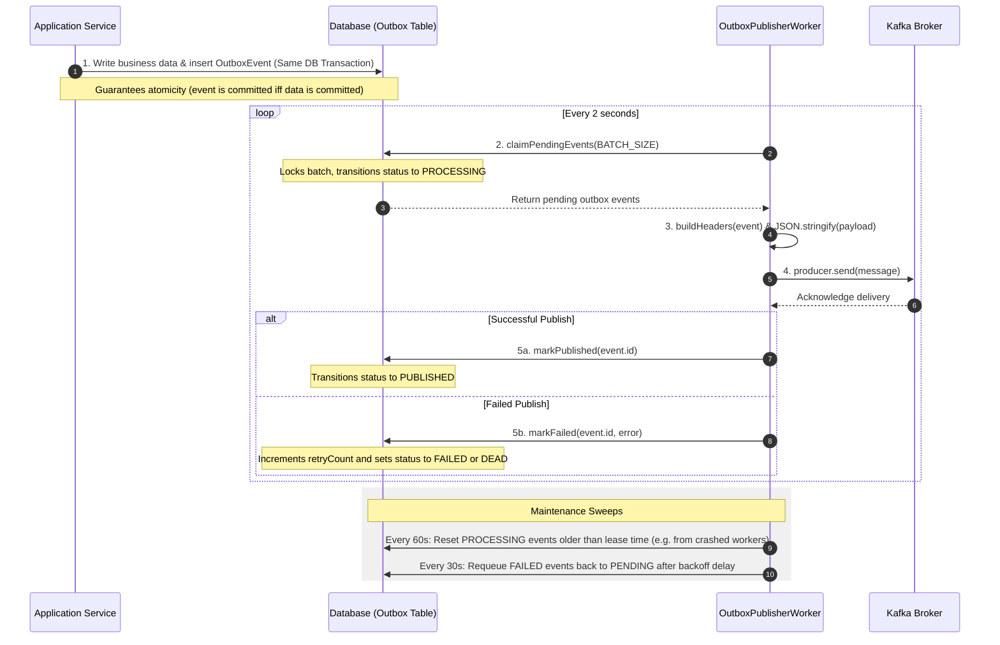

# @irctc/kafka

The centralized Kafka library for the IRCTC-style distributed railway booking platform. Built on top of the officially supported `@confluentinc/kafka-javascript` (using native `librdkafka` bindings) to provide reliable, high-throughput message streaming.

## Features

- **Centralized Client & Caching:** Single-point configuration and lifecycle management of client connections and shared producer instances.
- **Consumer Runner:** Standardized subscription runner wrapper with integrated OpenTelemetry trace context propagation.
- **Dead Letter Queue (DLQ):** Fault-tolerant DLQ wrapper routing message processing failures to dead letter topics with diagnostic headers.
- **Transactional Outbox Worker:** Outbox publishing loop helping microservices commit events to the DB first and asynchronously emit them to Kafka exactly-once.
- **Standardized Retries:** Built-in aggressive and conservative retry profiles optimized for messaging infrastructure.

## Directory Structure

```text
packages/kafka/
├── src/
│   ├── client/           # Kafka client, producer, and consumer constructors
│   ├── consumer-runner/  # Event loop runners and DLQ wrappers
│   ├── headers/          # Standard event header definitions
│   ├── outbox/           # Transactional Outbox pattern publisher worker
│   └── retry/            # Pre-configured retry policies
```

## Usage

### 1. Initializing the Client

```typescript
import { createKafkaClient } from "@irctc/kafka";

const kafka = createKafkaClient({
  clientId: "my-service",
  brokers: ["localhost:9092"],
});
```

### 2. Creating a Producer

Use the `KafkaProducerManager` singleton wrapper to retrieve a shared, connected producer instance:

```typescript
import { KafkaProducerManager } from "@irctc/kafka";

// Asynchronously retrieve and connect
const producer = await KafkaProducerManager.getProducer(kafka);

// Send messages
await producer.send({
  topic: "user-registered",
  messages: [
    { key: "user-123", value: JSON.stringify({ email: "user@example.com" }) },
  ],
});
```

### 3. Creating & Running a Consumer

```typescript
import { createConsumer, KafkaConsumerRunner } from "@irctc/kafka";

const consumer = createConsumer(kafka, "my-consumer-group");
const runner = new KafkaConsumerRunner(consumer, logger);

await runner.run("user-registered", async (payload) => {
  const { message } = payload;
  const data = JSON.parse(message.value.toString("utf8"));
  console.log("Received registration event:", data);
});
```

### 4. Running the Outbox Worker

```typescript
import { OutboxPublisherWorker } from "@irctc/kafka";

const outboxWorker = new OutboxPublisherWorker(outboxRepository, () =>
  KafkaProducerManager.getProducerSync(),
);

outboxWorker.start();
```

## Transactional Outbox Pattern: How it Works

The transactional outbox pattern guarantees **at-least-once message delivery** from microservices to Kafka without relying on distributed transactions (which are slow and complex).



### Components:

1. **Outbox Database Table:** A table storing event records (containing topic, message key, serialized payload, status, retry count, etc.).
2. **Database Transaction:** The application updates the aggregate model (e.g., booking created) and writes the event to the outbox table in the _same_ database transaction.
3. **OutboxPublisherWorker:**
   - **Continuous Polling Loop:** Periodically claims batches of events with `PROCESSING` state using database lock skipping to prevent dual-worker claims.
   - **Kafka Serialization & Dispatch:** Serializes payloads to JSON, maps tracing context from database headers onto Kafka headers, and dispatches them to their designated topics.
   - **Error Handling & Backoff:** If dispatch fails, increments the retry count and backs off. If the retry threshold is exceeded, transitions the event to the `DEAD` state for manual intervention.
   - **Self-Healing sweeps:** Runs recurring intervals to recover stuck `PROCESSING` events from crashed node instances and retry backoff-completed failures.

## Configuration & Compatibility Details

This package uses `@confluentinc/kafka-javascript`, which has strict configuration schemas:

- Producer, consumer, and client options must be defined under the `kafkaJS` nested object block.
- **Subscribe properties** like `fromBeginning` are set at **creation-time** inside `kafka.consumer({ kafkaJS: { fromBeginning } })` instead of `.subscribe()`.
- Immutable settings like `factor` and `multiplier` are automatically sanitized from retry options prior to initialization to prevent `ERR__INVALID_ARG` (code `-186`) validation errors.
