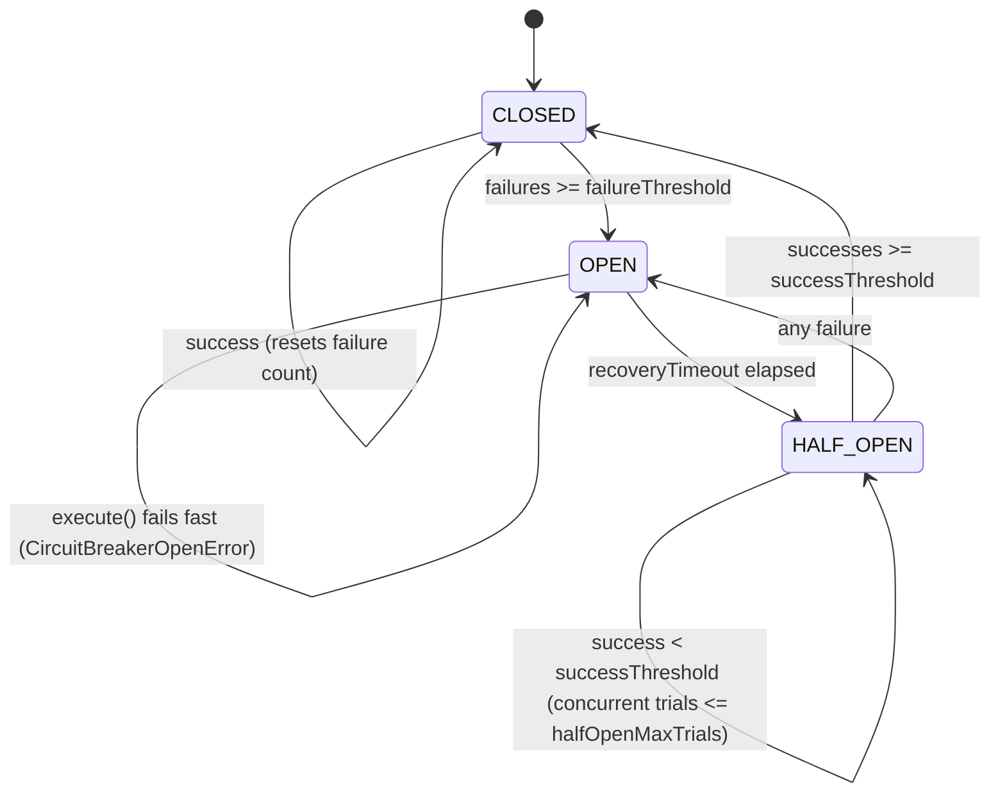

# @irctc/resilience

A lightweight, robust, TypeScript-first resilience package for the IRCTC booking platform. It implements critical patterns for fault tolerance, rate limiting, and self-healing:

1. **Circuit Breaker** — Prevents cascading failures and isolates unhealthy remote services.
2. **Token Bucket Rate Limiter** — Prevents API abuse and handles traffic shaping atomically via Redis.
3. **Exponential Backoff Retry** — Gracefully handles transient network/database glitches.

## 1. Circuit Breaker

### What is a Circuit Breaker?

In distributed systems, services often make remote calls to other services or databases. If a downstream service is struggling or down, requests can fail, consume resources, and cause cascading failures across the entire system.

A **Circuit Breaker** wraps the execution of these remote calls. It monitors for failures and, when a threshold is crossed, trips the circuit to immediately return an error without calling the underlying service. This protects the failing service from overload and allows the caller to handle the failure gracefully (e.g., return cached data or a fallback response).

### State Machine

The Circuit Breaker operates in one of three states:



1. **CLOSED**:
   - All executions pass through to the protected function.
   - Successful executions reset the consecutive failure count.
   - If consecutive failures reach `failureThreshold`, the breaker transitions to `OPEN` and triggers the `onCircuitOpen` callback.

2. **OPEN**:
   - All executions fail fast, throwing a `CircuitBreakerOpenError`.
   - The protected function is not executed.
   - If the duration since the breaker opened exceeds `recoveryTimeout`, a subsequent execution triggers a lazy transition to `HALF_OPEN` and runs the protected function.

3. **HALF_OPEN**:
   - A limited number of trial executions (configured by `halfOpenMaxTrials`) are allowed to run concurrently.
   - If any trial execution **fails**, the breaker immediately transitions back to `OPEN` and resets the recovery timer.
   - If trial executions **succeed**, they increment the success count. Once the success count reaches `successThreshold`, the breaker transitions back to `CLOSED`.
   - If concurrent trial executions exceed `halfOpenMaxTrials`, extra parallel executions fail fast with a `CircuitBreakerHalfOpenError`.

### Configuration Options (Circuit Breaker)

The circuit breaker options are validated at runtime using `zod`.

| Option              | Type       | Default         | Description                                                                           |
| :------------------ | :--------- | :-------------- | :------------------------------------------------------------------------------------ |
| `name`              | `string`   | _Required_      | Unique name of the circuit breaker.                                                   |
| `failureThreshold`  | `number`   | `5`             | Number of consecutive failures in `CLOSED` state before tripping to `OPEN`.           |
| `successThreshold`  | `number`   | `3`             | Number of consecutive successes in `HALF_OPEN` state before closing to `CLOSED`.      |
| `recoveryTimeout`   | `number`   | `60000` (1 min) | Time in ms to wait before attempting recovery (moving from `OPEN` to `HALF_OPEN`).    |
| `halfOpenMaxTrials` | `number`   | `3`             | Maximum number of concurrent executions allowed during `HALF_OPEN` state.             |
| `timeoutMs`         | `number`   | `5000` (5s)     | Execution timeout limit in ms. Rejects with `CircuitBreakerTimeoutError` if exceeded. |
| `onError`           | `function` | `() => {}`      | Callback triggered when a wrapped execution fails.                                    |
| `onSuccess`         | `function` | `() => {}`      | Callback triggered when a wrapped execution succeeds.                                 |
| `onCircuitOpen`     | `function` | `() => {}`      | Callback triggered when the state transitions to `OPEN`.                              |
| `onCircuitClosed`   | `function` | `() => {}`      | Callback triggered when the state transitions to `CLOSED`.                            |
| `onCircuitHalfOpen` | `function` | `() => {}`      | Callback triggered when the state transitions to `HALF_OPEN`.                         |
| `onCircuitTimeout`  | `function` | `() => {}`      | Callback triggered when a wrapped execution times out.                                |

### Circuit Breaker Code Examples

#### Basic Usage

```typescript
import { CircuitBreaker, CircuitBreakerOpenError } from "@irctc/resilience";

const breaker = new CircuitBreaker({
  name: "user-service-breaker",
  failureThreshold: 3,
  recoveryTimeout: 10000, // 10 seconds
  timeoutMs: 3000, // 3 seconds execution timeout
});

async function fetchUser(userId: string) {
  try {
    const user = await breaker.execute(async () => {
      const response = await fetch(
        `http://user-service/api/v1/users/${userId}`,
      );
      if (!response.ok) throw new Error("API error");
      return response.json();
    });
    return user;
  } catch (error) {
    if (error instanceof CircuitBreakerOpenError) {
      console.warn("Circuit is open! Returning fallback/cached user.");
      return getFallbackUser(userId);
    }
    throw error;
  }
}
```

#### Diagnostics & Callbacks

```typescript
const breaker = new CircuitBreaker({
  name: "payment-gateway",
  failureThreshold: 5,
  onCircuitOpen: (name) => {
    console.error(`Alert! Circuit ${name} has been tripped to OPEN state.`);
  },
  onCircuitClosed: (name) => {
    console.info(`Recovery! Circuit ${name} has returned to CLOSED state.`);
  },
});
```

## 2. Token Bucket Rate Limiter

A distributed, atomic rate limiter backed by Redis. Refills and consumption are executed in a single round-trip using an atomic Lua script. It prevents race conditions and utilizes the Redis server time to prevent application node clock-skew issues.

### Configuration Options

| Option         | Type     | Default    | Description                                                          |
| :------------- | :------- | :--------- | :------------------------------------------------------------------- |
| `capacity`     | `number` | _Required_ | Maximum number of tokens the bucket can hold. Must be $\ge 1$.       |
| `refillPerSec` | `number` | _Required_ | Number of tokens added back to the bucket per second. Must be $> 0$. |

### Rate Limiter Code Example

```typescript
import Redis from "ioredis";
import { TokenBucketRateLimiter } from "@irctc/resilience";

const redis = new Redis("redis://localhost:6379");
const rateLimiter = new TokenBucketRateLimiter(redis);

async function handleApiCall(userId: string) {
  const limitKey = `rate-limit:api:${userId}`;

  // Capacity of 10 tokens, refilling at 2 tokens per second
  const result = await rateLimiter.consume(limitKey, {
    capacity: 10,
    refillPerSec: 2,
  });

  if (!result.allowed) {
    throw new Error(`Rate limit exceeded. Try again in ${result.resetMs}ms`);
  }

  console.log(`Allowed. Remaining tokens: ${result.remaining}`);
}
```

## 3. Exponential Backoff Retry

Retries failing operations with a delay that increases exponentially on each retry to prevent resource contention (thundering herd problem).

### Configuration Options

All options are validated via `zod`.

| Option      | Type     | Default | Description                                                                    |
| :---------- | :------- | :------ | :----------------------------------------------------------------------------- |
| `retries`   | `number` | `5`     | Maximum number of retry attempts. Max `50`.                                    |
| `initialMs` | `number` | `100`   | Initial delay in milliseconds for the first retry. Max `1000`.                 |
| `maxMs`     | `number` | `10000` | Maximum cap on delay duration. Max `30000` (must be greater than `initialMs`). |

### Retry Code Example

```typescript
import { withExponentialBackoff } from "@irctc/resilience";

async function fetchFromDbWithRetry() {
  return await withExponentialBackoff(
    async () => {
      // Connect / Query Database
      const data = await db.query("SELECT * FROM bookings");
      return data;
    },
    {
      retries: 3,
      initialMs: 200,
      maxMs: 5000,
    },
  );
}
```

## Installation

This package is a workspace package in the `distributed_railway_booking_platform` monorepo. Add it to any service's dependencies:

```json
"dependencies": {
  "@irctc/resilience": "workspace:*"
}
```
